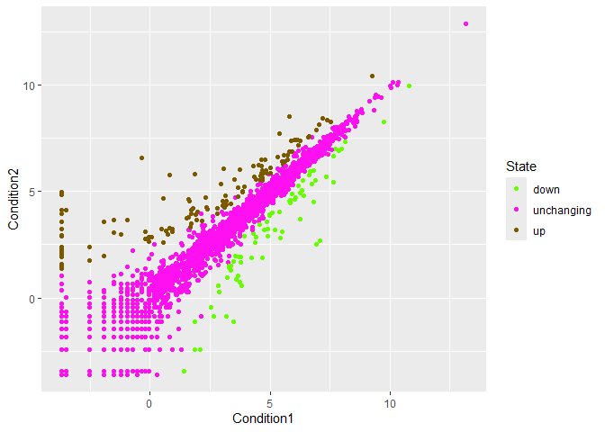
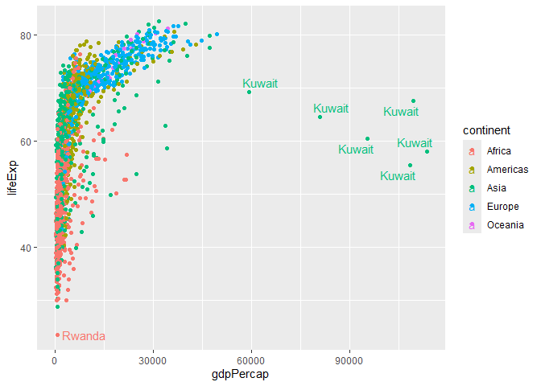

# Class 05: Data Visualization with **ggplot**
Qihao Liu

Today we are exploring the **ggplot** package and how to make nice
figures in R.

There are lots of ways to make figures and plots in R. These include:

- so called “base” R
- and add on packages like **ggplot**

Below is a simple “base” R plot:

``` r
head(cars)
```

      speed dist
    1     4    2
    2     4   10
    3     7    4
    4     7   22
    5     8   16
    6     9   10

We can simply pass this do the `plot()` function.

``` r
plot(cars)
```


> key-point: Base R is quick but not so nice-looking in some folks’
> eyes.

Now we are gonna make this plot with **ggplot2**

1st we need to install the **ggplot** package with the
`install.packages()` function. - since we only need to install the
package **once**, we do not want to install this package into the code
chunk (as this will cause the code to run slowly because the package is
getting installed over and over gain). **Instead** we are gonna install
it in R brain (the console)

2nd we need to load the package with the `library()` function everytime
we want to use it

``` r
library(ggplot2)
ggplot(cars)
```


This did not work because every gg plot is composed of at least 3 layers

- data (i.e a data.frame with the things to plot)
- aesthetics **aes()** that map the columns of the data to your plot
  feature
- geoms like **geom_point()**

``` r
ggplot(cars) +
  aes(x=speed,y=dist) +
  geom_point()
```


Compare base R plot with **ggplot**

> key-point: For a simple “canned” plot, because R is quicker and more
> concise to write the code but as things get more customed and
> elaborate, the *ggplot* wins out.

Let’s add more layers to our ggplot.

- Add a line showing the relationship between x and y (se=FALSE takes
  out the range around the linear fit)
- Add a title
- Add costume labels, x will be Speed (M/S), y will be dist (ft)
- Change the theme

``` r
ggplot(cars) +
  aes(x=speed,y=dist) +
  geom_point()+
  geom_smooth(method="lm", se=FALSE)+
  labs(title = "Silly plot of Speed vs Stoping Distance", 
       x = "Speed (M/S)", 
       y = "Dist (ft)") + 
  theme_bw()
```

    `geom_smooth()` using formula = 'y ~ x'


\##Going Further

Read some gene expression data:

``` r
url <- "https://bioboot.github.io/bimm143_S20/class-material/up_down_expression.txt"
genes <- read.delim(url)
summary(genes)
```

         Gene             Condition1        Condition2         State          
     Length:5196        Min.   :-3.6809   Min.   :-3.5921   Length:5196       
     Class :character   1st Qu.:-3.6809   1st Qu.:-3.5921   Class :character  
     Mode  :character   Median :-0.9439   Median :-0.8552   Mode  :character  
                        Mean   : 0.1800   Mean   : 0.2796                     
                        3rd Qu.: 4.0859   3rd Qu.: 4.0437                     
                        Max.   :13.1733   Max.   :12.8731                     

``` r
summary(genes[,"State"] =="up")
```

       Mode   FALSE    TRUE 
    logical    5069     127 

``` r
head(genes)
```

            Gene Condition1 Condition2      State
    1      A4GNT -3.6808610 -3.4401355 unchanging
    2       AAAS  4.5479580  4.3864126 unchanging
    3      AASDH  3.7190695  3.4787276 unchanging
    4       AATF  5.0784720  5.0151916 unchanging
    5       AATK  0.4711421  0.5598642 unchanging
    6 AB015752.4 -3.6808610 -3.5921390 unchanging

> Q1. how many genes are in this data set? Anwer: 5196

``` r
nrow(genes)
```

    [1] 5196

``` r
ncol(genes)
```

    [1] 4

> 12. How many “up” regulated genes are there? Answer: 127

note: a useful function for counting up occurrences of things in a
vector is the `table()` function.

``` r
summary(genes[,"State"] =="up")
```

       Mode   FALSE    TRUE 
    logical    5069     127 

``` r
#or
sum(genes$State == "up")
```

    [1] 127

``` r
#or
table(genes$State)
```


          down unchanging         up 
            72       4997        127 

Now we are gonna make the first plot using the gene data.

Make a V1 figure

``` r
library(ggplot2)
ggplot(genes)+
  aes(x=Condition1, 
      y=Condition2)+
  geom_point()
```


Now add colors to the graph to show up/down regulation

- use `col = variable` in aes() to color based on specific variable
- use
  `+scale_colour_manual(values = c( "#D79D00","#79797C", "#C5AECF"))` to
  add additional layer to define custom color scale
- we can also use `p<-` to save as a plot object, and use
  `p+additional layers` to build on the graph

``` r
library(ggplot2)
p <- ggplot(genes)+
  aes(x=Condition1, 
      y=Condition2,
      col = State)+
  scale_colour_manual(values = c( "#66ff00","#FF10F0", "#7A5901"))+
  geom_point()

p
```



``` r
p +
  geom_boxplot()
```


## Going Further

First, read the *gapminder* dataset

``` r
url <- "https://raw.githubusercontent.com/jennybc/gapminder/master/inst/extdata/gapminder.tsv"

gapminder <- read.delim(url)
```

Now let’s have a wee peak

``` r
head(gapminder, 3)
```

          country continent year lifeExp      pop gdpPercap
    1 Afghanistan      Asia 1952  28.801  8425333  779.4453
    2 Afghanistan      Asia 1957  30.332  9240934  820.8530
    3 Afghanistan      Asia 1962  31.997 10267083  853.1007

``` r
tail(gapminder, 3)
```

          country continent year lifeExp      pop gdpPercap
    1702 Zimbabwe    Africa 1997  46.809 11404948  792.4500
    1703 Zimbabwe    Africa 2002  39.989 11926563  672.0386
    1704 Zimbabwe    Africa 2007  43.487 12311143  469.7093

``` r
summary(gapminder)
```

       country           continent              year         lifeExp     
     Length:1704        Length:1704        Min.   :1952   Min.   :23.60  
     Class :character   Class :character   1st Qu.:1966   1st Qu.:48.20  
     Mode  :character   Mode  :character   Median :1980   Median :60.71  
                                           Mean   :1980   Mean   :59.47  
                                           3rd Qu.:1993   3rd Qu.:70.85  
                                           Max.   :2007   Max.   :82.60  
          pop              gdpPercap       
     Min.   :6.001e+04   Min.   :   241.2  
     1st Qu.:2.794e+06   1st Qu.:  1202.1  
     Median :7.024e+06   Median :  3531.8  
     Mean   :2.960e+07   Mean   :  7215.3  
     3rd Qu.:1.959e+07   3rd Qu.:  9325.5  
     Max.   :1.319e+09   Max.   :113523.1  

> Q4. How many countries are in this dataset? Answer:142

``` r
#Recall for 
x <- c(1:5)
x
```

    [1] 1 2 3 4 5

``` r
#we can use
length(x)
```

    [1] 5

``` r
# this tells us how many elements are in X
length(table(gapminder$country))
```

    [1] 142

``` r
#or
length(unique(gapminder[,"country"]))
```

    [1] 142

> Q5. How many continents are in this dataset? Answer: 5

``` r
table(gapminder$continent)
```


      Africa Americas     Asia   Europe  Oceania 
         624      300      396      360       24 

``` r
length(table(gapminder$continent))
```

    [1] 5

``` r
#or
unique(gapminder[,"continent"])
```

    [1] "Asia"     "Europe"   "Africa"   "Americas" "Oceania" 

``` r
length(unique(gapminder[,"continent"]))
```

    [1] 5

Now we make a plot study the relationship between life expectancy and
GDP

Make a v1 plot:

``` r
ggplot(gapminder)+
  aes(x = gdpPercap, y = lifeExp, color = continent)+
  geom_point()
```


Make a v2 plot:

``` r
ggplot(gapminder)+
  aes(x = gdpPercap, y = lifeExp, color = continent,label = country)+
  geom_text()+
  geom_point()
```


we can use a package to adjust the labels: `ggrepl`, this will help us
make more sensible, easier-to-read labels

``` r
library(ggrepel)
ggplot(gapminder)+
  aes(x = gdpPercap, y = lifeExp, color = continent,label = country)+
  geom_point()+
  geom_text_repel()
```

    Warning: ggrepel: 1697 unlabeled data points (too many overlaps). Consider
    increasing max.overlaps



Now we want to make this plot multi-paneled by continent

``` r
ggplot(gapminder)+
  aes(x = gdpPercap, y = lifeExp, color = continent)+
  geom_point()+
  facet_wrap(~continent)
```


Summary: What are the advantages of ggplot over base R plot?

ggplot2 offers several advantages over base R plot:

- It produces more visually appealing, publication-quality figures with
  sensible defaults, making it easier to create beautiful and complex
  plots quickly
  [\[1\]](https://drive.google.com/file/d/1BYSWJLROqxA1YpuDhJkzUolhiZqiOOKg/view?usp=drivesdk),
  [\[3\]](https://drive.google.com/file/d/1tFqKg9_nhVMmKYfiM1CQKDS2PmPwLh8n/view?usp=drivesdk),
  [\[2\]](https://drive.google.com/file/d/1Clw2_EJ_hY3USNwObiPnxpIQIfirxfW0/view?usp=drivesdk),
  [\[5\]](https://drive.google.com/file/d/15xXaaIcCWOc_x1gJLdySWOd_sfMXTiaw/view?usp=drivesdk).
- Plots are built using a consistent, layered grammar (data, aesthetics,
  geometry), which makes code more readable and modular
  [\[1\]](https://drive.google.com/file/d/1BYSWJLROqxA1YpuDhJkzUolhiZqiOOKg/view?usp=drivesdk),
  [\[3\]](https://drive.google.com/file/d/1tFqKg9_nhVMmKYfiM1CQKDS2PmPwLh8n/view?usp=drivesdk),
  [\[5\]](https://drive.google.com/file/d/15xXaaIcCWOc_x1gJLdySWOd_sfMXTiaw/view?usp=drivesdk).
- Customizing and refining plots is easier and less “fiddly” than with
  base R, which often requires many arguments and manual adjustments
  [\[1\]](https://drive.google.com/file/d/1BYSWJLROqxA1YpuDhJkzUolhiZqiOOKg/view?usp=drivesdk),
  [\[3\]](https://drive.google.com/file/d/1tFqKg9_nhVMmKYfiM1CQKDS2PmPwLh8n/view?usp=drivesdk),
  [\[2\]](https://drive.google.com/file/d/1Clw2_EJ_hY3USNwObiPnxpIQIfirxfW0/view?usp=drivesdk).
- ggplot2 enables declarative specification of plots, mapping data to
  visual features in a clear way
  [\[1\]](https://drive.google.com/file/d/1BYSWJLROqxA1YpuDhJkzUolhiZqiOOKg/view?usp=drivesdk),
  [\[3\]](https://drive.google.com/file/d/1tFqKg9_nhVMmKYfiM1CQKDS2PmPwLh8n/view?usp=drivesdk).
- Adding layers (e.g., points, lines, labels) and combining plots is
  straightforward, while base R often requires more complex code for
  advanced visualizations
  [\[1\]](https://drive.google.com/file/d/1BYSWJLROqxA1YpuDhJkzUolhiZqiOOKg/view?usp=drivesdk),
  [\[3\]](https://drive.google.com/file/d/1tFqKg9_nhVMmKYfiM1CQKDS2PmPwLh8n/view?usp=drivesdk),
  [\[5\]](https://drive.google.com/file/d/15xXaaIcCWOc_x1gJLdySWOd_sfMXTiaw/view?usp=drivesdk).
- ggplot2 is widely used and supported, with extensive documentation and
  community resources
  [\[1\]](https://drive.google.com/file/d/1BYSWJLROqxA1YpuDhJkzUolhiZqiOOKg/view?usp=drivesdk),
  [\[3\]](https://drive.google.com/file/d/1tFqKg9_nhVMmKYfiM1CQKDS2PmPwLh8n/view?usp=drivesdk),
  [\[2\]](https://drive.google.com/file/d/1Clw2_EJ_hY3USNwObiPnxpIQIfirxfW0/view?usp=drivesdk).

What aspect of ggplot2 are you most interested in using?
