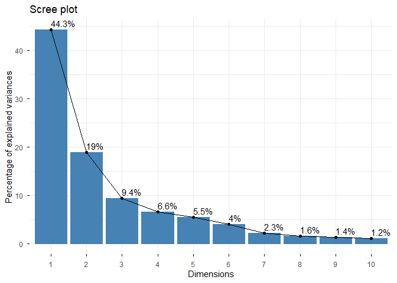
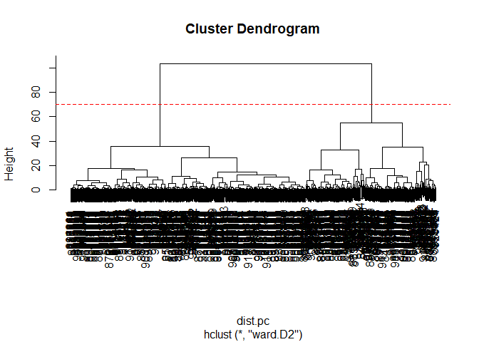

# Class08_Mini_Project
Qihao Liu

- [Exploratory data analysis](#exploratory-data-analysis)
  - [Data import](#data-import)
  - [Exploratory data analysis](#exploratory-data-analysis-1)
- [Principal Component Analysis](#principal-component-analysis)
  - [Performing PCA](#performing-pca)
  - [Interpreting PCA results](#interpreting-pca-results)
  - [Variance Explained](#variance-explained)
  - [Communicating PCA results](#communicating-pca-results)
- [Hierarchical clustering](#hierarchical-clustering)
  - [Results of hierarchical
    clustering](#results-of-hierarchical-clustering)
  - [Selecting number of clusters](#selecting-number-of-clusters)
  - [Using different methods](#using-different-methods)
- [Optional: K-means Clustering](#optional-k-means-clustering)
  - [k-means clustering and comparing
    results](#k-means-clustering-and-comparing-results)
- [Combining methods](#combining-methods)
  - [Clustering on PCA results](#clustering-on-pca-results)
- [Sensitivity & Specificity](#sensitivity--specificity)
- [Prediction](#prediction)

# Exploratory data analysis

## Data import

Data was downloaded from class website as a .csv file. The csv file is
imported into R as a data frame.

Note that the first column here wisc.df\$diagnosis is a pathologist
provided expert diagnosis. We will not be using this for our
unsupervised analysis as it is essentially the “answer” to the question
which cell samples are malignant or benign.

``` r
# Save your input data file into your Project directory
fna.data <- read.csv("WisconsinCancer.csv")

# Complete the following code to input the data and store as wisc.df
wisc.df <- read.csv("WisconsinCancer.csv", row.names=1)

# We can use -1 here to remove the first column
wisc.data <- wisc.df[,-1]
head(wisc.data)
```

             radius_mean texture_mean perimeter_mean area_mean smoothness_mean
    842302         17.99        10.38         122.80    1001.0         0.11840
    842517         20.57        17.77         132.90    1326.0         0.08474
    84300903       19.69        21.25         130.00    1203.0         0.10960
    84348301       11.42        20.38          77.58     386.1         0.14250
    84358402       20.29        14.34         135.10    1297.0         0.10030
    843786         12.45        15.70          82.57     477.1         0.12780
             compactness_mean concavity_mean concave.points_mean symmetry_mean
    842302            0.27760         0.3001             0.14710        0.2419
    842517            0.07864         0.0869             0.07017        0.1812
    84300903          0.15990         0.1974             0.12790        0.2069
    84348301          0.28390         0.2414             0.10520        0.2597
    84358402          0.13280         0.1980             0.10430        0.1809
    843786            0.17000         0.1578             0.08089        0.2087
             fractal_dimension_mean radius_se texture_se perimeter_se area_se
    842302                  0.07871    1.0950     0.9053        8.589  153.40
    842517                  0.05667    0.5435     0.7339        3.398   74.08
    84300903                0.05999    0.7456     0.7869        4.585   94.03
    84348301                0.09744    0.4956     1.1560        3.445   27.23
    84358402                0.05883    0.7572     0.7813        5.438   94.44
    843786                  0.07613    0.3345     0.8902        2.217   27.19
             smoothness_se compactness_se concavity_se concave.points_se
    842302        0.006399        0.04904      0.05373           0.01587
    842517        0.005225        0.01308      0.01860           0.01340
    84300903      0.006150        0.04006      0.03832           0.02058
    84348301      0.009110        0.07458      0.05661           0.01867
    84358402      0.011490        0.02461      0.05688           0.01885
    843786        0.007510        0.03345      0.03672           0.01137
             symmetry_se fractal_dimension_se radius_worst texture_worst
    842302       0.03003             0.006193        25.38         17.33
    842517       0.01389             0.003532        24.99         23.41
    84300903     0.02250             0.004571        23.57         25.53
    84348301     0.05963             0.009208        14.91         26.50
    84358402     0.01756             0.005115        22.54         16.67
    843786       0.02165             0.005082        15.47         23.75
             perimeter_worst area_worst smoothness_worst compactness_worst
    842302            184.60     2019.0           0.1622            0.6656
    842517            158.80     1956.0           0.1238            0.1866
    84300903          152.50     1709.0           0.1444            0.4245
    84348301           98.87      567.7           0.2098            0.8663
    84358402          152.20     1575.0           0.1374            0.2050
    843786            103.40      741.6           0.1791            0.5249
             concavity_worst concave.points_worst symmetry_worst
    842302            0.7119               0.2654         0.4601
    842517            0.2416               0.1860         0.2750
    84300903          0.4504               0.2430         0.3613
    84348301          0.6869               0.2575         0.6638
    84358402          0.4000               0.1625         0.2364
    843786            0.5355               0.1741         0.3985
             fractal_dimension_worst
    842302                   0.11890
    842517                   0.08902
    84300903                 0.08758
    84348301                 0.17300
    84358402                 0.07678
    843786                   0.12440

Setup a separate new vector called diagnosis that contains the data from
the diagnosis column of the original dataset. We will store this as a
factor (useful for plotting) and use this later to check our results.
(we want to test clustering to see if it partitions the data correctly,
having this would be cheating)

``` r
diagnosis <- factor(wisc.df$diagnosis) 
head(diagnosis)
```

    [1] M M M M M M
    Levels: B M

## Exploratory data analysis

> Q1. How many observations are in this dataset?

There are 569 observations in this datase

> Q2. How many of the observations have a malignant diagnosis?

There are 212 malignant diagnosis

``` r
table(wisc.df$diagnosis)
```


      B   M 
    357 212 

> Q3. How many variables/features in the data are suffixed with \_mean?

There are 10 variables/features in the data are suffixed with “\_mean”

``` r
colnames(wisc.df)
```

     [1] "diagnosis"               "radius_mean"            
     [3] "texture_mean"            "perimeter_mean"         
     [5] "area_mean"               "smoothness_mean"        
     [7] "compactness_mean"        "concavity_mean"         
     [9] "concave.points_mean"     "symmetry_mean"          
    [11] "fractal_dimension_mean"  "radius_se"              
    [13] "texture_se"              "perimeter_se"           
    [15] "area_se"                 "smoothness_se"          
    [17] "compactness_se"          "concavity_se"           
    [19] "concave.points_se"       "symmetry_se"            
    [21] "fractal_dimension_se"    "radius_worst"           
    [23] "texture_worst"           "perimeter_worst"        
    [25] "area_worst"              "smoothness_worst"       
    [27] "compactness_worst"       "concavity_worst"        
    [29] "concave.points_worst"    "symmetry_worst"         
    [31] "fractal_dimension_worst"

``` r
grep("_mean",colnames(wisc.df))
```

     [1]  2  3  4  5  6  7  8  9 10 11

``` r
length(grep("_mean",colnames(wisc.df)))
```

    [1] 10

# Principal Component Analysis

## Performing PCA

Note: use the `prcomp()`function to do PCA

- If we look at the argument in `prcomp()`, we can see that
  `scale. = FALSE` by default. However, if a column has a high value of
  variance, and `scale. = FALSE`, PCA will be dominated by columns with
  large variance (*not a feature, just the nature of numbers for certain
  parameter, i.e.speed of walking for different people is give or take
  ~4-5m/s, but the number of hairs is ~90k-150k. Number of hair would
  have a much larger variance, which will dominate PCA, but it doesn’t
  necessarily makes it a more meaningful way to cluster different groups
  of people*). That’s why **in general we should use `scale. = TRUE`**

Check the mean and standard deviation of the features (i.e. columns) of
the wisc.data to determine if the data should be scaled. Use the
colMeans() and apply() functions like you’ve done before.

``` r
# Check column means and standard deviations
colMeans(wisc.data)
```

                radius_mean            texture_mean          perimeter_mean 
               1.412729e+01            1.928965e+01            9.196903e+01 
                  area_mean         smoothness_mean        compactness_mean 
               6.548891e+02            9.636028e-02            1.043410e-01 
             concavity_mean     concave.points_mean           symmetry_mean 
               8.879932e-02            4.891915e-02            1.811619e-01 
     fractal_dimension_mean               radius_se              texture_se 
               6.279761e-02            4.051721e-01            1.216853e+00 
               perimeter_se                 area_se           smoothness_se 
               2.866059e+00            4.033708e+01            7.040979e-03 
             compactness_se            concavity_se       concave.points_se 
               2.547814e-02            3.189372e-02            1.179614e-02 
                symmetry_se    fractal_dimension_se            radius_worst 
               2.054230e-02            3.794904e-03            1.626919e+01 
              texture_worst         perimeter_worst              area_worst 
               2.567722e+01            1.072612e+02            8.805831e+02 
           smoothness_worst       compactness_worst         concavity_worst 
               1.323686e-01            2.542650e-01            2.721885e-01 
       concave.points_worst          symmetry_worst fractal_dimension_worst 
               1.146062e-01            2.900756e-01            8.394582e-02 

``` r
apply(wisc.data,2,sd)
```

                radius_mean            texture_mean          perimeter_mean 
               3.524049e+00            4.301036e+00            2.429898e+01 
                  area_mean         smoothness_mean        compactness_mean 
               3.519141e+02            1.406413e-02            5.281276e-02 
             concavity_mean     concave.points_mean           symmetry_mean 
               7.971981e-02            3.880284e-02            2.741428e-02 
     fractal_dimension_mean               radius_se              texture_se 
               7.060363e-03            2.773127e-01            5.516484e-01 
               perimeter_se                 area_se           smoothness_se 
               2.021855e+00            4.549101e+01            3.002518e-03 
             compactness_se            concavity_se       concave.points_se 
               1.790818e-02            3.018606e-02            6.170285e-03 
                symmetry_se    fractal_dimension_se            radius_worst 
               8.266372e-03            2.646071e-03            4.833242e+00 
              texture_worst         perimeter_worst              area_worst 
               6.146258e+00            3.360254e+01            5.693570e+02 
           smoothness_worst       compactness_worst         concavity_worst 
               2.283243e-02            1.573365e-01            2.086243e-01 
       concave.points_worst          symmetry_worst fractal_dimension_worst 
               6.573234e-02            6.186747e-02            1.806127e-02 

We can see that there’s large difference between the standard deviations
of different variables, so we should use scaling

Next, we do our PCA

``` r
# Perform PCA on wisc.data by completing the following code
wisc.pr <- prcomp(wisc.data,scale. = TRUE)

# Look at summary of results
summary(wisc.pr)
```

    Importance of components:
                              PC1    PC2     PC3     PC4     PC5     PC6     PC7
    Standard deviation     3.6444 2.3857 1.67867 1.40735 1.28403 1.09880 0.82172
    Proportion of Variance 0.4427 0.1897 0.09393 0.06602 0.05496 0.04025 0.02251
    Cumulative Proportion  0.4427 0.6324 0.72636 0.79239 0.84734 0.88759 0.91010
                               PC8    PC9    PC10   PC11    PC12    PC13    PC14
    Standard deviation     0.69037 0.6457 0.59219 0.5421 0.51104 0.49128 0.39624
    Proportion of Variance 0.01589 0.0139 0.01169 0.0098 0.00871 0.00805 0.00523
    Cumulative Proportion  0.92598 0.9399 0.95157 0.9614 0.97007 0.97812 0.98335
                              PC15    PC16    PC17    PC18    PC19    PC20   PC21
    Standard deviation     0.30681 0.28260 0.24372 0.22939 0.22244 0.17652 0.1731
    Proportion of Variance 0.00314 0.00266 0.00198 0.00175 0.00165 0.00104 0.0010
    Cumulative Proportion  0.98649 0.98915 0.99113 0.99288 0.99453 0.99557 0.9966
                              PC22    PC23   PC24    PC25    PC26    PC27    PC28
    Standard deviation     0.16565 0.15602 0.1344 0.12442 0.09043 0.08307 0.03987
    Proportion of Variance 0.00091 0.00081 0.0006 0.00052 0.00027 0.00023 0.00005
    Cumulative Proportion  0.99749 0.99830 0.9989 0.99942 0.99969 0.99992 0.99997
                              PC29    PC30
    Standard deviation     0.02736 0.01153
    Proportion of Variance 0.00002 0.00000
    Cumulative Proportion  1.00000 1.00000

> Q4. From your results, what proportion of the original variance is
> captured by the first principal components (PC1)?

44.27% of the original variance is captured by PC1

> Q5. How many principal components (PCs) are required to describe at
> least 70% of the original variance in the data?

3 PCs are required, because the Cumulative Proportion for PC3 is 72.636%

> Q6. How many principal components (PCs) are required to describe at
> least 90% of the original variance in the data?

7 PCs are required

## Interpreting PCA results

Now you will use some visualizations to better understand your PCA
model.

First, we use gg plot to make scatter plot

``` r
library(ggplot2)
head(wisc.pr$x)
```

                   PC1        PC2        PC3       PC4        PC5         PC6
    842302   -9.184755  -1.946870 -1.1221788 3.6305364  1.1940595  1.41018364
    842517   -2.385703   3.764859 -0.5288274 1.1172808 -0.6212284  0.02863116
    84300903 -5.728855   1.074229 -0.5512625 0.9112808  0.1769302  0.54097615
    84348301 -7.116691 -10.266556 -3.2299475 0.1524129  2.9582754  3.05073750
    84358402 -3.931842   1.946359  1.3885450 2.9380542 -0.5462667 -1.22541641
    843786   -2.378155  -3.946456 -2.9322967 0.9402096  1.0551135 -0.45064213
                     PC7         PC8         PC9       PC10       PC11       PC12
    842302    2.15747152  0.39805698 -0.15698023 -0.8766305 -0.2627243 -0.8582593
    842517    0.01334635 -0.24077660 -0.71127897  1.1060218 -0.8124048  0.1577838
    84300903 -0.66757908 -0.09728813  0.02404449  0.4538760  0.6050715  0.1242777
    84348301  1.42865363 -1.05863376 -1.40420412 -1.1159933  1.1505012  1.0104267
    84358402 -0.93538950 -0.63581661 -0.26357355  0.3773724 -0.6507870 -0.1104183
    843786    0.49001396  0.16529843 -0.13335576 -0.5299649 -0.1096698  0.0813699
                    PC13         PC14         PC15        PC16        PC17
    842302    0.10329677 -0.690196797  0.601264078  0.74446075 -0.26523740
    842517   -0.94269981 -0.652900844 -0.008966977 -0.64823831 -0.01719707
    84300903 -0.41026561  0.016665095 -0.482994760  0.32482472  0.19075064
    84348301 -0.93245070 -0.486988399  0.168699395  0.05132509  0.48220960
    84358402  0.38760691 -0.538706543 -0.310046684 -0.15247165  0.13302526
    843786   -0.02625135  0.003133944 -0.178447576 -0.01270566  0.19671335
                    PC18       PC19        PC20         PC21        PC22
    842302   -0.54907956  0.1336499  0.34526111  0.096430045 -0.06878939
    842517    0.31801756 -0.2473470 -0.11403274 -0.077259494  0.09449530
    84300903 -0.08789759 -0.3922812 -0.20435242  0.310793246  0.06025601
    84348301 -0.03584323 -0.0267241 -0.46432511  0.433811661  0.20308706
    84358402 -0.01869779  0.4610302  0.06543782 -0.116442469  0.01763433
    843786   -0.29727706 -0.1297265 -0.07117453 -0.002400178  0.10108043
                    PC23         PC24         PC25         PC26        PC27
    842302    0.08444429  0.175102213  0.150887294 -0.201326305 -0.25236294
    842517   -0.21752666 -0.011280193  0.170360355 -0.041092627  0.18111081
    84300903 -0.07422581 -0.102671419 -0.171007656  0.004731249  0.04952586
    84348301 -0.12399554 -0.153294780 -0.077427574 -0.274982822  0.18330078
    84358402  0.13933105  0.005327110 -0.003059371  0.039219780  0.03213957
    843786    0.03344819 -0.002837749 -0.122282765 -0.030272333 -0.08438081
                      PC28         PC29          PC30
    842302   -0.0338846387  0.045607590  0.0471277407
    842517    0.0325955021 -0.005682424  0.0018662342
    84300903  0.0469844833  0.003143131 -0.0007498749
    84348301  0.0424469831 -0.069233868  0.0199198881
    84358402 -0.0347556386  0.005033481 -0.0211951203
    843786    0.0007296587 -0.019703996 -0.0034564331

``` r
ggplot(wisc.pr$x) +
  aes(PC1, PC2, col = diagnosis) +
  geom_point()
```


This plot clearly shows two distinct population of patients within our
data set. We are going to compare this plot with some other plots.

A common visualization for PCA results is the so-called biplot.

Create a biplot of the wisc.pr using the biplot() function.

``` r
biplot(wisc.pr)
```


> Q7. What stands out to you about this plot? Is it easy or difficult to
> understand? Why?

No thing really stands out about this plot. It is very messy and
difficult to understand because the text labels are all clumpped
together

> Q8 Generate a similar plot for principal components 1 and 3. What do
> you notice about these plots?

I noticed that from these scatter plot that the there are clearly two
distinct patient population with in the dataset, and these groups can be
separated by the diagnosis. Compare PC1 vs PC2 and PC1 vs PC3, we can
see that PC1 vs PC2 gives a clearer separation (makes sense because PC1
and PC2 collectively captures more variance)

``` r
library(ggplot2)
head(wisc.pr$x)
```

                   PC1        PC2        PC3       PC4        PC5         PC6
    842302   -9.184755  -1.946870 -1.1221788 3.6305364  1.1940595  1.41018364
    842517   -2.385703   3.764859 -0.5288274 1.1172808 -0.6212284  0.02863116
    84300903 -5.728855   1.074229 -0.5512625 0.9112808  0.1769302  0.54097615
    84348301 -7.116691 -10.266556 -3.2299475 0.1524129  2.9582754  3.05073750
    84358402 -3.931842   1.946359  1.3885450 2.9380542 -0.5462667 -1.22541641
    843786   -2.378155  -3.946456 -2.9322967 0.9402096  1.0551135 -0.45064213
                     PC7         PC8         PC9       PC10       PC11       PC12
    842302    2.15747152  0.39805698 -0.15698023 -0.8766305 -0.2627243 -0.8582593
    842517    0.01334635 -0.24077660 -0.71127897  1.1060218 -0.8124048  0.1577838
    84300903 -0.66757908 -0.09728813  0.02404449  0.4538760  0.6050715  0.1242777
    84348301  1.42865363 -1.05863376 -1.40420412 -1.1159933  1.1505012  1.0104267
    84358402 -0.93538950 -0.63581661 -0.26357355  0.3773724 -0.6507870 -0.1104183
    843786    0.49001396  0.16529843 -0.13335576 -0.5299649 -0.1096698  0.0813699
                    PC13         PC14         PC15        PC16        PC17
    842302    0.10329677 -0.690196797  0.601264078  0.74446075 -0.26523740
    842517   -0.94269981 -0.652900844 -0.008966977 -0.64823831 -0.01719707
    84300903 -0.41026561  0.016665095 -0.482994760  0.32482472  0.19075064
    84348301 -0.93245070 -0.486988399  0.168699395  0.05132509  0.48220960
    84358402  0.38760691 -0.538706543 -0.310046684 -0.15247165  0.13302526
    843786   -0.02625135  0.003133944 -0.178447576 -0.01270566  0.19671335
                    PC18       PC19        PC20         PC21        PC22
    842302   -0.54907956  0.1336499  0.34526111  0.096430045 -0.06878939
    842517    0.31801756 -0.2473470 -0.11403274 -0.077259494  0.09449530
    84300903 -0.08789759 -0.3922812 -0.20435242  0.310793246  0.06025601
    84348301 -0.03584323 -0.0267241 -0.46432511  0.433811661  0.20308706
    84358402 -0.01869779  0.4610302  0.06543782 -0.116442469  0.01763433
    843786   -0.29727706 -0.1297265 -0.07117453 -0.002400178  0.10108043
                    PC23         PC24         PC25         PC26        PC27
    842302    0.08444429  0.175102213  0.150887294 -0.201326305 -0.25236294
    842517   -0.21752666 -0.011280193  0.170360355 -0.041092627  0.18111081
    84300903 -0.07422581 -0.102671419 -0.171007656  0.004731249  0.04952586
    84348301 -0.12399554 -0.153294780 -0.077427574 -0.274982822  0.18330078
    84358402  0.13933105  0.005327110 -0.003059371  0.039219780  0.03213957
    843786    0.03344819 -0.002837749 -0.122282765 -0.030272333 -0.08438081
                      PC28         PC29          PC30
    842302   -0.0338846387  0.045607590  0.0471277407
    842517    0.0325955021 -0.005682424  0.0018662342
    84300903  0.0469844833  0.003143131 -0.0007498749
    84348301  0.0424469831 -0.069233868  0.0199198881
    84358402 -0.0347556386  0.005033481 -0.0211951203
    843786    0.0007296587 -0.019703996 -0.0034564331

``` r
ggplot(wisc.pr$x) +
  aes(PC1, PC3, col = diagnosis) +
  geom_point()
```


## Variance Explained

Calculate the variance of each principal component by squaring the sdev
component of wisc.pr (i.e. wisc.pr\$sdev^2). Save the result as an
object called pr.var.

``` r
# Calculate variance of each component
pr.var <- wisc.pr$sdev^2
head(pr.var)
```

    [1] 13.281608  5.691355  2.817949  1.980640  1.648731  1.207357

Calculate the variance explained by each principal component by dividing
by the total variance explained of all principal components. Assign this
to a variable called pve and create a plot of variance explained for
each principal component.

``` r
# Variance explained by each principal component: pve
pve <- pr.var / sum(pr.var)

# Plot variance explained for each principal component
plot(pve, xlab = "Principal Component", 
     ylab = "Proportion of Variance Explained", 
     ylim = c(0, 1), type = "o")
```


``` r
# Alternative scree plot of the same data, note data driven y-axis
barplot(pve, ylab = "Precent of Variance Explained",
     names.arg=paste0("PC",1:length(pve)), las=2, axes = FALSE)
axis(2, at=pve, labels=round(pve,2)*100 )
```


``` r
## ggplot based graph
#install.packages("factoextra")
library(factoextra)
```

    Welcome! Want to learn more? See two factoextra-related books at https://goo.gl/ve3WBa

``` r
fviz_eig(wisc.pr, addlabels = TRUE)
```

    Warning in geom_bar(stat = "identity", fill = barfill, color = barcolor, :
    Ignoring empty aesthetic: `width`.



## Communicating PCA results

> Q9. For the first principal component, what is the component of the
> loading vector (i.e. wisc.pr\$rotation\[,1\]) for the feature
> concave.points_mean?

The loading vector of the first PC for the feature concave.point_mean is
-0.2608538

> Q10. What is the minimum number of principal components required to
> explain 80% of the variance of the data?

5

``` r
summary(wisc.pr)
```

    Importance of components:
                              PC1    PC2     PC3     PC4     PC5     PC6     PC7
    Standard deviation     3.6444 2.3857 1.67867 1.40735 1.28403 1.09880 0.82172
    Proportion of Variance 0.4427 0.1897 0.09393 0.06602 0.05496 0.04025 0.02251
    Cumulative Proportion  0.4427 0.6324 0.72636 0.79239 0.84734 0.88759 0.91010
                               PC8    PC9    PC10   PC11    PC12    PC13    PC14
    Standard deviation     0.69037 0.6457 0.59219 0.5421 0.51104 0.49128 0.39624
    Proportion of Variance 0.01589 0.0139 0.01169 0.0098 0.00871 0.00805 0.00523
    Cumulative Proportion  0.92598 0.9399 0.95157 0.9614 0.97007 0.97812 0.98335
                              PC15    PC16    PC17    PC18    PC19    PC20   PC21
    Standard deviation     0.30681 0.28260 0.24372 0.22939 0.22244 0.17652 0.1731
    Proportion of Variance 0.00314 0.00266 0.00198 0.00175 0.00165 0.00104 0.0010
    Cumulative Proportion  0.98649 0.98915 0.99113 0.99288 0.99453 0.99557 0.9966
                              PC22    PC23   PC24    PC25    PC26    PC27    PC28
    Standard deviation     0.16565 0.15602 0.1344 0.12442 0.09043 0.08307 0.03987
    Proportion of Variance 0.00091 0.00081 0.0006 0.00052 0.00027 0.00023 0.00005
    Cumulative Proportion  0.99749 0.99830 0.9989 0.99942 0.99969 0.99992 0.99997
                              PC29    PC30
    Standard deviation     0.02736 0.01153
    Proportion of Variance 0.00002 0.00000
    Cumulative Proportion  1.00000 1.00000

# Hierarchical clustering

Just clustering the original data is not very helpful, so…

First scale the wisc.data data and assign the result to data.scaled.

``` r
# Scale the wisc.data data using the "scale()" function
data.scaled <- scale(wisc.data)
```

Calculate the (Euclidean) distances between all pairs of observations in
the new scaled dataset and assign the result to data.dist.

``` r
data.dist <- dist(data.scaled)
```

Create a hierarchical clustering model using complete linkage. Manually
specify the method argument to hclust() and assign the results to
wisc.hclust.

``` r
wisc.hclust <- hclust(data.dist,method = "complete")
```

## Results of hierarchical clustering

> Q11. Using the plot() and abline() functions, what is the height at
> which the clustering model has 4 clusters?

At height = 19, we can get 4 clusters

- Note: But this is not very helpful because it really doesnt relay any
  insight/information about the dataset to us. So we give up on this
  approach

``` r
plot(wisc.hclust)
head(cutree(wisc.hclust, k=4))
```

      842302   842517 84300903 84348301 84358402   843786 
           1        1        1        2        1        1 

``` r
table(cutree(wisc.hclust,k=4))
```


      1   2   3   4 
    177   7 383   2 

``` r
abline(h=19, col="red", lty=2)
```


## Selecting number of clusters

Next we are going to compare the outputs from the hierarchical
clustering model to the actual diagnosis.

Recall, we have the diagnosis factor, maybe it will help if we see where
the malignent and benign diagnosis are in the h-clustering?

``` r
table((cutree(wisc.hclust,k=4)), diagnosis)
```

       diagnosis
          B   M
      1  12 165
      2   2   5
      3 343  40
      4   0   2

Next, we are gonna explore how different number of clusters affect the
ability of the hierarchical clustering to separate the different
diagnosis

> Q12. Can you fin d abetter cluster vs diagnoses match by cutting into
> a different number of clusters between 2 and 10?

It is difficulty to find a cluster vs diagnoses match that is
meaningful. In comparison, it is slightly better when we cluster the
data in 4,5, 6, or 7 clusters as in these cases, most malignent
diagnosis is clustered under cluster 1 and most benign diagnosis is
clustered under cluster 3, but these clustering methods also generates a
number of cluster that is meaningless (can be interpreted as another
cluster’s equivalent), so without prior knowledge of the diagnosis, they
would not be meaningful to us.

``` r
test_cluster <- function(x){
  table((cutree(wisc.hclust,k=x)), diagnosis)
}
test_cluster(2)
```

       diagnosis
          B   M
      1 357 210
      2   0   2

``` r
test_cluster(3)
```

       diagnosis
          B   M
      1 355 205
      2   2   5
      3   0   2

``` r
test_cluster(5)
```

       diagnosis
          B   M
      1  12 165
      2   0   5
      3 343  40
      4   2   0
      5   0   2

``` r
test_cluster(6)
```

       diagnosis
          B   M
      1  12 165
      2   0   5
      3 331  39
      4   2   0
      5  12   1
      6   0   2

``` r
test_cluster(7)
```

       diagnosis
          B   M
      1  12 165
      2   0   3
      3 331  39
      4   2   0
      5  12   1
      6   0   2
      7   0   2

``` r
test_cluster(8)
```

       diagnosis
          B   M
      1  12  86
      2   0  79
      3   0   3
      4 331  39
      5   2   0
      6  12   1
      7   0   2
      8   0   2

``` r
test_cluster(9)
```

       diagnosis
          B   M
      1  12  86
      2   0  79
      3   0   3
      4 331  39
      5   2   0
      6  12   0
      7   0   2
      8   0   2
      9   0   1

``` r
test_cluster(10)
```

        diagnosis
           B   M
      1   12  86
      2    0  59
      3    0   3
      4  331  39
      5    0  20
      6    2   0
      7   12   0
      8    0   2
      9    0   2
      10   0   1

This confirms that this clustering is useless.

## Using different methods

> Q13. Which method gives your favorite results for the same data.dist
> dataset? Explain your reasoning

the complete linkage method usually gives me my favorite results for the
same data.dist dataset because it always give me distinct
populations/clustering by using the largest of all pair-wise similarity
to determine the clustering.

# Optional: K-means Clustering

## k-means clustering and comparing results

We will next try create a k-means clustering model on the Wisconsin
breat cancer data and compare the results to the acutual diagnosis

First, we will create a k-means model on `wisc.data`

``` r
wisc.km <- kmeans(data.scaled,centers=2,nstart=3)
table(wisc.km$cluster, diagnosis)
```

       diagnosis
          B   M
      1 343  37
      2  14 175

> Q14. How well does k-means separate the two diagnoses?How does it
> compare to your hclust results?

The k-means separate the two diagnoses fairlyl well, with the malignent
and benign diagnoses in cluster 1 and 2 respectively. It is does do a
better job compare to the hclust we performed earlier.

``` r
test_cluster(4)
```

       diagnosis
          B   M
      1  12 165
      2   2   5
      3 343  40
      4   0   2

# Combining methods

So let’s try combine PCA with h-clustering since clustering of the
origianl data is not productive, PCA is promising, so maybe we can
cluster from PCA results (clustering in PC space)

## Clustering on PCA results

Since the first 3 PCs can capture 70% of variance, we can try to cluster
them first

``` r
# First we get the frist 3 PCs, pastt it through a dist matrix function, call it dist.pc
dist.pc <- dist(wisc.pr$x[, 1:3])
wisc.pr.hclust <- hclust(dist.pc, method="ward.D2")
plot(wisc.pr.hclust)
abline(h=70, col="red", lty=2)
```



It is good that we can see there’s two main clusters. Now we are gonna
try to see if this clustering is good by comparing it with the diagnosis
results.

To get our clustering membership vector, we cut the tree at a desired
height to yeild 2 cluster (with `cuttree()` at either h=70, or k=2) We
can the use `table()` to compare the clustering results with the
diagnosis results. This clustering groups is fairly accurate when
compare to expert diagnosis. (For Diagnosis purpose, for malignent, we
have 24 false positives out of 203 cases.)

``` r
grps <- cutree(wisc.pr.hclust, k=2)
table(grps)
```

    grps
      1   2 
    203 366 

``` r
table(grps, diagnosis)
```

        diagnosis
    grps   B   M
       1  24 179
       2 333  33

``` r
plot(wisc.pr$x[,1:2], col=grps)
```


# Sensitivity & Specificity

> Q15. How well does the newly created model with four clusters
> separates out the two diagnosis

The newly created model with 2 clusters separates out eh two diagnosis
pretty neatly, as most of the malignent diagnosis is in cluster 1 while
most of the benign diagnosis is in cluster 2

> Q16. How well do the k-means and hierarchical clustering you created
> in previous section do in terms of separating the diagnoses?

The k-means clustering does a decent job separating the diagnoses (not
as well as PCA); the hierarchical clustering does not do a goo job
separating the diagnosis.

``` r
table(wisc.km$cluster,diagnosis)
```

       diagnosis
          B   M
      1 343  37
      2  14 175

``` r
test_cluster(4)
```

       diagnosis
          B   M
      1  12 165
      2   2   5
      3 343  40
      4   0   2

Sensitivity refers to a test’s ability to correctly detect ill patients
who do have the condition. In our example here the sensitivity is the
total number of samples in the cluster identified as predominantly
malignant (cancerous) divided by the total number of known malignant
samples. In other words: TP/(TP+FN).

Specificity relates to a test’s ability to correctly reject healthy
patients without a condition. In our example specificity is the
proportion of benign (not cancerous) samples in the cluster identified
as predominantly benign that are known to be benign. In other words:
TN/(TN+FN).

Now let’s try calculate these numbers from the matrix

``` r
N <- table(grps, diagnosis)
N
```

        diagnosis
    grps   B   M
       1  24 179
       2 333  33

``` r
Sensitivity <- N[1,2]/sum(N[1,])
Sensitivity
```

    [1] 0.8817734

``` r
Specificity <- N[2,1]/sum(N[2,])
Specificity
```

    [1] 0.9098361

> Q17. Which of your analysis procedure resulted in a clustering model
> with the best specificity?How about sensitivity?

Both K-means and PCA-hclust combined clustering both results in the
highest specificity. The hierarchical clustering with k=2 has the
highest sensitivity, but this is because almost all patients are grouped
under cluster 1, so it has good ability to correctly detect ill patients
who do have the condition. Otherwise, the sensitivities of the k-means
method and the combined method are the same.

``` r
N <- table(grps, diagnosis)
N
```

        diagnosis
    grps   B   M
       1  24 179
       2 333  33

``` r
Sensitivity <- N[1,2]/sum(N[1,])
Sensitivity
```

    [1] 0.8817734

``` r
Specificity <- N[2,1]/sum(N[2,])
Specificity
```

    [1] 0.9098361

``` r
M <- table(wisc.km$cluster, diagnosis)
M
```

       diagnosis
          B   M
      1 343  37
      2  14 175

``` r
Sensitivity <- N[1,2]/sum(N[1,])
Sensitivity
```

    [1] 0.8817734

``` r
Specificity <- N[2,1]/sum(N[2,])
Specificity
```

    [1] 0.9098361

``` r
O <- table(cutree(wisc.hclust,k=2), diagnosis)
O
```

       diagnosis
          B   M
      1 357 210
      2   0   2

``` r
Sensitivity <- O[1,2]/sum(N[1,])
Sensitivity
```

    [1] 1.034483

``` r
Specificity <- O[2,1]/sum(N[2,])
Specificity
```

    [1] 0

# Prediction

We can use our PCA model for predicting with new input patient samples

``` r
#url <- "new_samples.csv"
url <- "https://tinyurl.com/new-samples-CSV"
new <- read.csv(url)
npc <- predict(wisc.pr, newdata=new)
npc
```

               PC1       PC2        PC3        PC4       PC5        PC6        PC7
    [1,]  2.576616 -3.135913  1.3990492 -0.7631950  2.781648 -0.8150185 -0.3959098
    [2,] -4.754928 -3.009033 -0.1660946 -0.6052952 -1.140698 -1.2189945  0.8193031
                PC8       PC9       PC10      PC11      PC12      PC13     PC14
    [1,] -0.2307350 0.1029569 -0.9272861 0.3411457  0.375921 0.1610764 1.187882
    [2,] -0.3307423 0.5281896 -0.4855301 0.7173233 -1.185917 0.5893856 0.303029
              PC15       PC16        PC17        PC18        PC19       PC20
    [1,] 0.3216974 -0.1743616 -0.07875393 -0.11207028 -0.08802955 -0.2495216
    [2,] 0.1299153  0.1448061 -0.40509706  0.06565549  0.25591230 -0.4289500
               PC21       PC22       PC23       PC24        PC25         PC26
    [1,]  0.1228233 0.09358453 0.08347651  0.1223396  0.02124121  0.078884581
    [2,] -0.1224776 0.01732146 0.06316631 -0.2338618 -0.20755948 -0.009833238
                 PC27        PC28         PC29         PC30
    [1,]  0.220199544 -0.02946023 -0.015620933  0.005269029
    [2,] -0.001134152  0.09638361  0.002795349 -0.019015820

``` r
plot(wisc.pr$x[,1:2],col=diagnosis)
cat(paste(levels(diagnosis),"=",palette()[seq_along(levels(diagnosis))],collapse = ","))
```

    B = black,M = #DF536B

``` r
points(npc[,1], npc[,2], col="blue", pch=16, cex=3)
text(npc[,1], npc[,2], c(1,2), col="white")
```


> Q18. Which of these new patients should we prioritize for follow up
> based on your results?

We should prioritize patient 2 based on the results since patient 2 is
placed in the cluster with malignent diagnosis.
