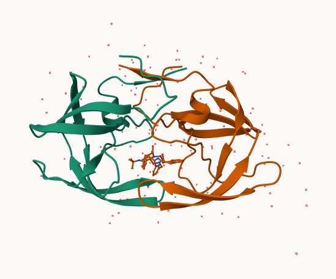
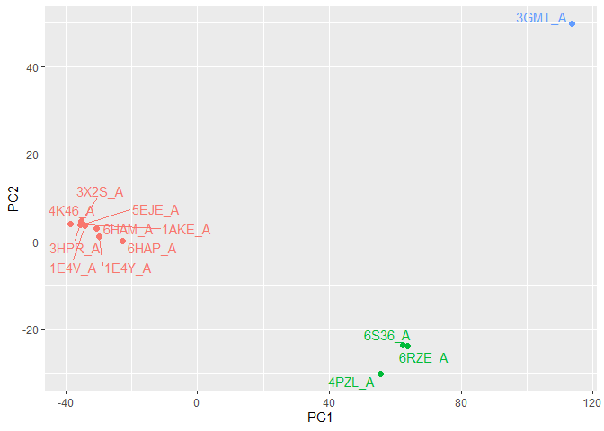

# Lab09:Structural Bioinformatics Pt.1
Qihao Liu (U08901197)

- [Introduction to the RCSB Protein Data Bank
  (PDB)](#introduction-to-the-rcsb-protein-data-bank-pdb)
  - [PDB statistics](#pdb-statistics)
  - [The PDB format](#the-pdb-format)
  - [Visualizing the HIV-1 protease
    structure](#visualizing-the-hiv-1-protease-structure)
    - [Using Mol\*](#using-mol)
    - [Getting to know HIV-Pr](#getting-to-know-hiv-pr)
- [Introduction to Bio3D in R](#introduction-to-bio3d-in-r)
  - [Quick PDB visualization in R](#quick-pdb-visualization-in-r)
  - [Predict Functional Motion](#predict-functional-motion)
- [Comparative Structure Analysis of Adenylate
  Kinase](#comparative-structure-analysis-of-adenylate-kinase)
  - [Set up](#set-up)
  - [Search and retrieve ADK
    structures](#search-and-retrieve-adk-structures)
  - [Align and superpose structures](#align-and-superpose-structures)
    - [Optional: Viewing our superposed
      structures](#optional-viewing-our-superposed-structures)
  - [Annotate collected PDB
    structures](#annotate-collected-pdb-structures)
  - [PCA](#pca)
- [Optional further visualization](#optional-further-visualization)
- [Normal mode analysis](#normal-mode-analysis)

# Introduction to the RCSB Protein Data Bank (PDB)

## PDB statistics

The main database for structural biology is called the PDB. Let’s have a
look at what it contains:

First, import the CSV file from PDB

``` r
stats <- read.csv("Data Export Summary.csv")
```

Notice that some of the supposedly numeric values are imputed as
character in the original CSV file So, if we try:

``` r
stats$X.ray
```

    [1] "176,204" "10,279"  "9,007"   "3,066"   "173"     "11"     

``` r
sum(stats$X.ray)
```

    Error in sum(stats$X.ray): invalid 'type' (character) of argument

Notice that the numbers has “” around them because they are characters,
and we receive a error when trying to calculate the sum of the X.ray
structures

- Note: This is due to the “,” in the numeric value

To fix this, we can try a different read function (need
`install.packages("tidyverse")`)

``` r
library("tidyverse")
stats <- read_csv("Data Export Summary.csv")
```

Now we try sum the structures solved by x.ray again, and it works:

``` r
sum(stats$`X-ray`)
```

    [1] 198740

> Q1: What percentage of structures in the PDB are solved by X-Ray and
> Electron Microscopy.

> A1: Percent of structures solved by x-ray is 81.48%, percent of
> structures solved by EM is 12.22%

``` r
#Structures solved by x-ray
x_ray <- (sum(stats$`X-ray`)/sum(stats$`Total`))*100
round(x_ray,2)
```

    [1] 81.48

``` r
#Structures solved by EM
em <- (sum(stats$`EM`)/sum(stats$`Total`))*100
round(em,2)
```

    [1] 12.22

> Q2: What proportion of structures in the PDB are protein?

``` r
protein <- round((sum(stats[1,2:8])/sum(stats$`Total`))*100,2)
```

> A2: 86.05% of structures are proteins

> Q3: Type HIV in the PDB website search box on the home page and
> determine how many HIV-1 protease structures are in the current PDB?

> A3: This query matches 4,865 Structures.

## The PDB format

No let’s try to examine some structures from PDB. Starting off by
downloading the 1HSG (HIV Protease) from PDB. This is the first protein
of HIV targeted by drug.

First we load a package for structural bioinformatics, bio3d. The
read.pdb function in this package allows us to get the PDB file for a
structure from the PDB website.

``` r
library("bio3d")
```

    Warning: package 'bio3d' was built under R version 4.5.2

``` r
hiv <- read.pdb("1HSG")
```

      Note: Accessing on-line PDB file

``` r
hiv
```


     Call:  read.pdb(file = "1HSG")

       Total Models#: 1
         Total Atoms#: 1686,  XYZs#: 5058  Chains#: 2  (values: A B)

         Protein Atoms#: 1514  (residues/Calpha atoms#: 198)
         Nucleic acid Atoms#: 0  (residues/phosphate atoms#: 0)

         Non-protein/nucleic Atoms#: 172  (residues: 128)
         Non-protein/nucleic resid values: [ HOH (127), MK1 (1) ]

       Protein sequence:
          PQITLWQRPLVTIKIGGQLKEALLDTGADDTVLEEMSLPGRWKPKMIGGIGGFIKVRQYD
          QILIEICGHKAIGTVLVGPTPVNIIGRNLLTQIGCTLNFPQITLWQRPLVTIKIGGQLKE
          ALLDTGADDTVLEEMSLPGRWKPKMIGGIGGFIKVRQYDQILIEICGHKAIGTVLVGPTP
          VNIIGRNLLTQIGCTLNF

    + attr: atom, xyz, seqres, helix, sheet,
            calpha, remark, call

## Visualizing the HIV-1 protease structure

### Using Mol\*

Let’s first use the Mol\* viewer to explore this structure (Mol\* is a
3D structure viewer runs online)

- Go to https://molstar.org/, input the PDB code, and apply
- Notice the MK1 compound in the center of the HIV protease
- Download a preliminary image of the structure, save the png. file in
  the project directory, include it in the lab sheets 

### Getting to know HIV-Pr

There is a water molecue and an aspartate residue (Asp25, D25) that is
important for the catalytic activity of HIV-Pr. Find them in the
structure

 \>Q4: Water molecules normally have 3 atoms. Why
do we see just one atom per water molecule in this structure?

> A4: Hydrogen is omitted from the H2O molecule because it is often not
> resolved

> Q5: There is a critical “conserved” water molecule in the binding
> site. Can you identify this water molecule? What residue number does
> this water molecule have

> A5:311

> Q6: Generate and save a figure clearly showing the two distinct chains
> of HIV-protease along with the ligand. You might also consider showing
> the catalytic residues ASP 25 in each chain and the critical water (we
> recommend “Ball & Stick” for these side-chains). Add this figure to
> your Quarto document.


> Discussion Topic: Can you think of a way in which indinavir, or even
> larger ligands and substrates, could enter the binding site?

> A: Because HIV-pr is formed by two homodimers, larger ligands can
> either enter the catalytic site when the two monomers forms a
> homodimer or it can also enter the binding site when the two monomers
> changes comformation in their active state, which provides passage
> into the active site.

> Q7: \[Optional\] As you have hopefully observed HIV protease is a
> homodimer (i.e. it is composed of two identical chains). With the aid
> of the graphic display can you identify secondary structure elements
> that are likely to only form in the dimer rather than the monomer?

> A7: The parallel betasheets on the C-terminus formed by two monomers
> is a structure elments that are likely to only form in the dimer
> rather than the monomer. Same goes to the catalytic site containing
> two aspartate residue, which only forms when the homodimer comes
> together.

# Introduction to Bio3D in R

\##Reading PDB file data into R

``` r
library("bio3d")
hiv <- read.pdb("1HSG")
```

      Note: Accessing on-line PDB file

    Warning in get.pdb(file, path = tempdir(), verbose = FALSE):
    C:\Users\Thoma\AppData\Local\Temp\RtmpuwTvRl/1HSG.pdb exists. Skipping download

``` r
head(hiv$atom)
```

      type eleno elety  alt resid chain resno insert      x      y     z o     b
    1 ATOM     1     N <NA>   PRO     A     1   <NA> 29.361 39.686 5.862 1 38.10
    2 ATOM     2    CA <NA>   PRO     A     1   <NA> 30.307 38.663 5.319 1 40.62
    3 ATOM     3     C <NA>   PRO     A     1   <NA> 29.760 38.071 4.022 1 42.64
    4 ATOM     4     O <NA>   PRO     A     1   <NA> 28.600 38.302 3.676 1 43.40
    5 ATOM     5    CB <NA>   PRO     A     1   <NA> 30.508 37.541 6.342 1 37.87
    6 ATOM     6    CG <NA>   PRO     A     1   <NA> 29.296 37.591 7.162 1 38.40
      segid elesy charge
    1  <NA>     N   <NA>
    2  <NA>     C   <NA>
    3  <NA>     C   <NA>
    4  <NA>     O   <NA>
    5  <NA>     C   <NA>
    6  <NA>     C   <NA>

> Q7: How many amino acid residues are there in this pdb object?

> A7: There are a total of 198 protein residues in this pdb project

> Q8: Name one of the two non-protein residue?

> A8: HOH

> Q9: How many protein chains are in the structure

> A9: 2

Extract the sequence

``` r
pdbseq(hiv)
```

      1   2   3   4   5   6   7   8   9  10  11  12  13  14  15  16  17  18  19  20 
    "P" "Q" "I" "T" "L" "W" "Q" "R" "P" "L" "V" "T" "I" "K" "I" "G" "G" "Q" "L" "K" 
     21  22  23  24  25  26  27  28  29  30  31  32  33  34  35  36  37  38  39  40 
    "E" "A" "L" "L" "D" "T" "G" "A" "D" "D" "T" "V" "L" "E" "E" "M" "S" "L" "P" "G" 
     41  42  43  44  45  46  47  48  49  50  51  52  53  54  55  56  57  58  59  60 
    "R" "W" "K" "P" "K" "M" "I" "G" "G" "I" "G" "G" "F" "I" "K" "V" "R" "Q" "Y" "D" 
     61  62  63  64  65  66  67  68  69  70  71  72  73  74  75  76  77  78  79  80 
    "Q" "I" "L" "I" "E" "I" "C" "G" "H" "K" "A" "I" "G" "T" "V" "L" "V" "G" "P" "T" 
     81  82  83  84  85  86  87  88  89  90  91  92  93  94  95  96  97  98  99   1 
    "P" "V" "N" "I" "I" "G" "R" "N" "L" "L" "T" "Q" "I" "G" "C" "T" "L" "N" "F" "P" 
      2   3   4   5   6   7   8   9  10  11  12  13  14  15  16  17  18  19  20  21 
    "Q" "I" "T" "L" "W" "Q" "R" "P" "L" "V" "T" "I" "K" "I" "G" "G" "Q" "L" "K" "E" 
     22  23  24  25  26  27  28  29  30  31  32  33  34  35  36  37  38  39  40  41 
    "A" "L" "L" "D" "T" "G" "A" "D" "D" "T" "V" "L" "E" "E" "M" "S" "L" "P" "G" "R" 
     42  43  44  45  46  47  48  49  50  51  52  53  54  55  56  57  58  59  60  61 
    "W" "K" "P" "K" "M" "I" "G" "G" "I" "G" "G" "F" "I" "K" "V" "R" "Q" "Y" "D" "Q" 
     62  63  64  65  66  67  68  69  70  71  72  73  74  75  76  77  78  79  80  81 
    "I" "L" "I" "E" "I" "C" "G" "H" "K" "A" "I" "G" "T" "V" "L" "V" "G" "P" "T" "P" 
     82  83  84  85  86  87  88  89  90  91  92  93  94  95  96  97  98  99 
    "V" "N" "I" "I" "G" "R" "N" "L" "L" "T" "Q" "I" "G" "C" "T" "L" "N" "F" 

Note that there are two chains included in this printed sequence. So we
are gonna get only sequence from chain A

``` r
trim.pdb(hiv,chain="A")
```


     Call:  trim.pdb(pdb = hiv, chain = "A")

       Total Models#: 1
         Total Atoms#: 801,  XYZs#: 2403  Chains#: 1  (values: A)

         Protein Atoms#: 757  (residues/Calpha atoms#: 99)
         Nucleic acid Atoms#: 0  (residues/phosphate atoms#: 0)

         Non-protein/nucleic Atoms#: 44  (residues: 44)
         Non-protein/nucleic resid values: [ HOH (44) ]

       Protein sequence:
          PQITLWQRPLVTIKIGGQLKEALLDTGADDTVLEEMSLPGRWKPKMIGGIGGFIKVRQYD
          QILIEICGHKAIGTVLVGPTPVNIIGRNLLTQIGCTLNF

    + attr: atom, helix, sheet, seqres, xyz,
            calpha, call

``` r
chainA_seq <- pdbseq(trim.pdb(hiv,chain="A"))
```

## Quick PDB visualization in R

Next, install the **bio3dview** packages on CRAN so we can interactively
view these PDB objets in R

``` r
library(bio3dview)
library(NGLVieweR)
```

    Warning: package 'NGLVieweR' was built under R version 4.5.2

``` r
view.pdb(hiv)

view.pdb(hiv, colorScheme = "sse", backgroundColor = "pink")

#Selecting ASP25 Residue
sel <- atom.select(hiv,resno=25)
view.pdb(hiv, highlight = sel,
         colorScheme = "sse",
        backgroundColor = "pink")
```

## Predict Functional Motion

``` r
library(bio3d)
#Read Structure
adk <- read.pdb("6s36")
```

      Note: Accessing on-line PDB file
       PDB has ALT records, taking A only, rm.alt=TRUE

``` r
adk
```


     Call:  read.pdb(file = "6s36")

       Total Models#: 1
         Total Atoms#: 1898,  XYZs#: 5694  Chains#: 1  (values: A)

         Protein Atoms#: 1654  (residues/Calpha atoms#: 214)
         Nucleic acid Atoms#: 0  (residues/phosphate atoms#: 0)

         Non-protein/nucleic Atoms#: 244  (residues: 244)
         Non-protein/nucleic resid values: [ CL (3), HOH (238), MG (2), NA (1) ]

       Protein sequence:
          MRIILLGAPGAGKGTQAQFIMEKYGIPQISTGDMLRAAVKSGSELGKQAKDIMDAGKLVT
          DELVIALVKERIAQEDCRNGFLLDGFPRTIPQADAMKEAGINVDYVLEFDVPDELIVDKI
          VGRRVHAPSGRVYHVKFNPPKVEGKDDVTGEELTTRKDDQEETVRKRLVEYHQMTAPLIG
          YYSKEAEAGNTKYAKVDGTKPVAEVRADLEKILG

    + attr: atom, xyz, seqres, helix, sheet,
            calpha, remark, call

``` r
#Run calculation
m <- nma(adk)
```

     Building Hessian...        Done in 0.05 seconds.
     Diagonalizing Hessian...   Done in 0.33 seconds.

``` r
m
```


    Call:
      nma.pdb(pdb = adk)

    Class:
      VibrationalModes (nma)

    Number of modes:
      642 (6 trivial)

    Frequencies:
      Mode 7:   0.005
      Mode 8:   0.007
      Mode 9:   0.009
      Mode 10:  0.011
      Mode 11:  0.013
      Mode 12:  0.015

    + attr: modes, frequencies, force.constants, fluctuations,
            U, L, xyz, mass, temp, triv.modes, natoms, call

``` r
plot(m)
```


Generate a “trajectory” of predicted motion

``` r
mktrj(m,file="ADK_nma.pdb")
view.nma(m, pdb=adk)
```

# Comparative Structure Analysis of Adenylate Kinase

The goal of this section is to perform principal component analysis
(PCA) on the complete collection of Adenylate kinase structures in the
protein data-bank (PDB).

## Set up

> Q10. Which of the packages above is found only on BioConductor and not
> CRAN?

> A10: msa

> Q11. Which of the above packages is not found on BioConductor or
> CRAN?:

> A11: bio3dview

> Q12. True or False? Functions from the pak package can be used to
> install packages from GitHub and BitBucket?

> A12: TRUE

## Search and retrieve ADK structures

Get ADK sequence from PDB

``` r
library(bio3d)
aa <- get.seq("1ake_A")
```

    Warning in get.seq("1ake_A"): Removing existing file: seqs.fasta

    Fetching... Please wait. Done.

``` r
aa
```

                 1        .         .         .         .         .         60 
    pdb|1AKE|A   MRIILLGAPGAGKGTQAQFIMEKYGIPQISTGDMLRAAVKSGSELGKQAKDIMDAGKLVT
                 1        .         .         .         .         .         60 

                61        .         .         .         .         .         120 
    pdb|1AKE|A   DELVIALVKERIAQEDCRNGFLLDGFPRTIPQADAMKEAGINVDYVLEFDVPDELIVDRI
                61        .         .         .         .         .         120 

               121        .         .         .         .         .         180 
    pdb|1AKE|A   VGRRVHAPSGRVYHVKFNPPKVEGKDDVTGEELTTRKDDQEETVRKRLVEYHQMTAPLIG
               121        .         .         .         .         .         180 

               181        .         .         .   214 
    pdb|1AKE|A   YYSKEAEAGNTKYAKVDGTKPVAEVRADLEKILG
               181        .         .         .   214 

    Call:
      read.fasta(file = outfile)

    Class:
      fasta

    Alignment dimensions:
      1 sequence rows; 214 position columns (214 non-gap, 0 gap) 

    + attr: id, ali, call

> Q13. How many amino acids are in this sequence, i.e. how long is this
> sequence?

> A13:214

Now we can use this sequence as a query to BLAST search the PDB to find
similar sequences and structures.

``` r
# Blast or hmmer search 
#b <- blast.pdb(aa)
#hits <- plot(b)
#head(hits$pdb.id)
```

Unable to access BLAST service at the time, try alternative code:

``` r
hits <- NULL
hits$pdb.id <- c('1AKE_A','6S36_A','6RZE_A','3HPR_A','1E4V_A','5EJE_A','1E4Y_A','3X2S_A','6HAP_A','6HAM_A','4K46_A','3GMT_A','4PZL_A')
#Download related PDB files
files <- get.pdb(hits$pdb.id, path="pdbs", split=TRUE, gzip=TRUE)
```

    Warning in get.pdb(hits$pdb.id, path = "pdbs", split = TRUE, gzip = TRUE):
    pdbs/1AKE.pdb exists. Skipping download

    Warning in get.pdb(hits$pdb.id, path = "pdbs", split = TRUE, gzip = TRUE):
    pdbs/6S36.pdb exists. Skipping download

    Warning in get.pdb(hits$pdb.id, path = "pdbs", split = TRUE, gzip = TRUE):
    pdbs/6RZE.pdb exists. Skipping download

    Warning in get.pdb(hits$pdb.id, path = "pdbs", split = TRUE, gzip = TRUE):
    pdbs/3HPR.pdb exists. Skipping download

    Warning in get.pdb(hits$pdb.id, path = "pdbs", split = TRUE, gzip = TRUE):
    pdbs/1E4V.pdb exists. Skipping download

    Warning in get.pdb(hits$pdb.id, path = "pdbs", split = TRUE, gzip = TRUE):
    pdbs/5EJE.pdb exists. Skipping download

    Warning in get.pdb(hits$pdb.id, path = "pdbs", split = TRUE, gzip = TRUE):
    pdbs/1E4Y.pdb exists. Skipping download

    Warning in get.pdb(hits$pdb.id, path = "pdbs", split = TRUE, gzip = TRUE):
    pdbs/3X2S.pdb exists. Skipping download

    Warning in get.pdb(hits$pdb.id, path = "pdbs", split = TRUE, gzip = TRUE):
    pdbs/6HAP.pdb exists. Skipping download

    Warning in get.pdb(hits$pdb.id, path = "pdbs", split = TRUE, gzip = TRUE):
    pdbs/6HAM.pdb exists. Skipping download

    Warning in get.pdb(hits$pdb.id, path = "pdbs", split = TRUE, gzip = TRUE):
    pdbs/4K46.pdb exists. Skipping download

    Warning in get.pdb(hits$pdb.id, path = "pdbs", split = TRUE, gzip = TRUE):
    pdbs/3GMT.pdb exists. Skipping download

    Warning in get.pdb(hits$pdb.id, path = "pdbs", split = TRUE, gzip = TRUE):
    pdbs/4PZL.pdb exists. Skipping download


      |                                                                            
      |                                                                      |   0%
      |                                                                            
      |=====                                                                 |   8%
      |                                                                            
      |===========                                                           |  15%
      |                                                                            
      |================                                                      |  23%
      |                                                                            
      |======================                                                |  31%
      |                                                                            
      |===========================                                           |  38%
      |                                                                            
      |================================                                      |  46%
      |                                                                            
      |======================================                                |  54%
      |                                                                            
      |===========================================                           |  62%
      |                                                                            
      |================================================                      |  69%
      |                                                                            
      |======================================================                |  77%
      |                                                                            
      |===========================================================           |  85%
      |                                                                            
      |=================================================================     |  92%
      |                                                                            
      |======================================================================| 100%

## Align and superpose structures

Next, use `pdbaln()` to align and superpose the identified PDB
structures

``` r
# Align releated PDBs
pdbs <- pdbaln(files, fit = TRUE, exefile="msa")
```

    Reading PDB files:
    pdbs/split_chain/1AKE_A.pdb
    pdbs/split_chain/6S36_A.pdb
    pdbs/split_chain/6RZE_A.pdb
    pdbs/split_chain/3HPR_A.pdb
    pdbs/split_chain/1E4V_A.pdb
    pdbs/split_chain/5EJE_A.pdb
    pdbs/split_chain/1E4Y_A.pdb
    pdbs/split_chain/3X2S_A.pdb
    pdbs/split_chain/6HAP_A.pdb
    pdbs/split_chain/6HAM_A.pdb
    pdbs/split_chain/4K46_A.pdb
    pdbs/split_chain/3GMT_A.pdb
    pdbs/split_chain/4PZL_A.pdb
       PDB has ALT records, taking A only, rm.alt=TRUE
    .   PDB has ALT records, taking A only, rm.alt=TRUE
    .   PDB has ALT records, taking A only, rm.alt=TRUE
    .   PDB has ALT records, taking A only, rm.alt=TRUE
    ..   PDB has ALT records, taking A only, rm.alt=TRUE
    ....   PDB has ALT records, taking A only, rm.alt=TRUE
    .   PDB has ALT records, taking A only, rm.alt=TRUE
    ...

    Extracting sequences

    pdb/seq: 1   name: pdbs/split_chain/1AKE_A.pdb 
       PDB has ALT records, taking A only, rm.alt=TRUE
    pdb/seq: 2   name: pdbs/split_chain/6S36_A.pdb 
       PDB has ALT records, taking A only, rm.alt=TRUE
    pdb/seq: 3   name: pdbs/split_chain/6RZE_A.pdb 
       PDB has ALT records, taking A only, rm.alt=TRUE
    pdb/seq: 4   name: pdbs/split_chain/3HPR_A.pdb 
       PDB has ALT records, taking A only, rm.alt=TRUE
    pdb/seq: 5   name: pdbs/split_chain/1E4V_A.pdb 
    pdb/seq: 6   name: pdbs/split_chain/5EJE_A.pdb 
       PDB has ALT records, taking A only, rm.alt=TRUE
    pdb/seq: 7   name: pdbs/split_chain/1E4Y_A.pdb 
    pdb/seq: 8   name: pdbs/split_chain/3X2S_A.pdb 
    pdb/seq: 9   name: pdbs/split_chain/6HAP_A.pdb 
    pdb/seq: 10   name: pdbs/split_chain/6HAM_A.pdb 
       PDB has ALT records, taking A only, rm.alt=TRUE
    pdb/seq: 11   name: pdbs/split_chain/4K46_A.pdb 
       PDB has ALT records, taking A only, rm.alt=TRUE
    pdb/seq: 12   name: pdbs/split_chain/3GMT_A.pdb 
    pdb/seq: 13   name: pdbs/split_chain/4PZL_A.pdb 

``` r
# Vector containing PDB codes for figure axis
ids <- basename.pdb(pdbs$id)

# Draw schematic alignment
plot(pdbs, labels=ids)
```


### Optional: Viewing our superposed structures

``` r
library(bio3dview)

view.pdbs(pdbs)
```

## Annotate collected PDB structures

`pdb.annotate()` allow us to annotate the PDB files we have downloaded

``` r
anno <- pdb.annotate(ids)
unique(anno$source)
```

    [1] "Escherichia coli"                                
    [2] "Escherichia coli K-12"                           
    [3] "Escherichia coli O139:H28 str. E24377A"          
    [4] "Escherichia coli str. K-12 substr. MDS42"        
    [5] "Photobacterium profundum"                        
    [6] "Burkholderia pseudomallei 1710b"                 
    [7] "Francisella tularensis subsp. tularensis SCHU S4"

``` r
head(anno)
```

           structureId chainId macromoleculeType chainLength experimentalTechnique
    1AKE_A        1AKE       A           Protein         214                 X-ray
    6S36_A        6S36       A           Protein         214                 X-ray
    6RZE_A        6RZE       A           Protein         214                 X-ray
    3HPR_A        3HPR       A           Protein         214                 X-ray
    1E4V_A        1E4V       A           Protein         214                 X-ray
    5EJE_A        5EJE       A           Protein         214                 X-ray
           resolution       scopDomain                                        pfam
    1AKE_A       2.00 Adenylate kinase Adenylate kinase, active site lid (ADK_lid)
    6S36_A       1.60             <NA> Adenylate kinase, active site lid (ADK_lid)
    6RZE_A       1.69             <NA> Adenylate kinase, active site lid (ADK_lid)
    3HPR_A       2.00             <NA>                      Adenylate kinase (ADK)
    1E4V_A       1.85 Adenylate kinase Adenylate kinase, active site lid (ADK_lid)
    5EJE_A       1.90             <NA>                      Adenylate kinase (ADK)
                   ligandId                                       ligandName
    1AKE_A              AP5                 BIS(ADENOSINE)-5'-PENTAPHOSPHATE
    6S36_A MG (2),NA,CL (3)    MAGNESIUM ION (2),SODIUM ION,CHLORIDE ION (3)
    6RZE_A    CL (2),NA (3)                  CHLORIDE ION (2),SODIUM ION (3)
    3HPR_A              AP5                 BIS(ADENOSINE)-5'-PENTAPHOSPHATE
    1E4V_A              AP5                 BIS(ADENOSINE)-5'-PENTAPHOSPHATE
    5EJE_A           AP5,CO BIS(ADENOSINE)-5'-PENTAPHOSPHATE,COBALT (II) ION
                                           source
    1AKE_A                       Escherichia coli
    6S36_A                       Escherichia coli
    6RZE_A                       Escherichia coli
    3HPR_A                  Escherichia coli K-12
    1E4V_A                       Escherichia coli
    5EJE_A Escherichia coli O139:H28 str. E24377A
                                                                                                                                                                         structureTitle
    1AKE_A STRUCTURE OF THE COMPLEX BETWEEN ADENYLATE KINASE FROM ESCHERICHIA COLI AND THE INHIBITOR AP5A REFINED AT 1.9 ANGSTROMS RESOLUTION: A MODEL FOR A CATALYTIC TRANSITION STATE
    6S36_A                                                                                                                   Crystal structure of E. coli Adenylate kinase R119K mutant
    6RZE_A                                                                                                                   Crystal structure of E. coli Adenylate kinase R119A mutant
    3HPR_A                                                                                               Crystal structure of V148G adenylate kinase from E. coli, in complex with Ap5A
    1E4V_A                                                                                                       Mutant G10V of adenylate kinase from E. coli, modified in the Gly-loop
    5EJE_A                                                                                  Crystal structure of E. coli Adenylate kinase G56C/T163C double mutant in complex with Ap5a
                                                        citation rObserved  rFree
    1AKE_A             Muller, C.W., et al. J Mol Biology (1992)    0.1960     NA
    6S36_A                 Rogne, P., et al. Biochemistry (2019)    0.1632 0.2356
    6RZE_A                 Rogne, P., et al. Biochemistry (2019)    0.1865 0.2350
    3HPR_A Schrank, T.P., et al. Proc Natl Acad Sci U S A (2009)    0.2100 0.2432
    1E4V_A                  Muller, C.W., et al. Proteins (1993)    0.1960     NA
    5EJE_A Kovermann, M., et al. Proc Natl Acad Sci U S A (2017)    0.1889 0.2358
            rWork spaceGroup
    1AKE_A 0.1960  P 21 2 21
    6S36_A 0.1594    C 1 2 1
    6RZE_A 0.1819    C 1 2 1
    3HPR_A 0.2062  P 21 21 2
    1E4V_A 0.1960  P 21 2 21
    5EJE_A 0.1863  P 21 2 21

## PCA

PCA can be performed on the structural ensemble (stored in the pdbs
object)

``` r
# Perform PCA
pc.xray <- pca(pdbs)
pc.xray
```


    Call:
      pca.pdbs(pdbs = pdbs)

    Class:
      pca

    Number of eigenvalues:
      612

            Eigenvalue Variance Cumulative
       PC 1   2824.299   84.993     84.993
       PC 2    384.613   11.574     96.568
       PC 3     62.077    1.868     98.436
       PC 4     19.614    0.590     99.026
       PC 5     14.644    0.441     99.467
       PC 6      5.228    0.157     99.624

       (Obtained from 13 conformers with 612 xyz input values).

    + attr: L, U, z, au, sdev, mean, call

``` r
plot(pc.xray)
```


Function rmsd() will calculate all pairwise RMSD values of the
structural ensemble. This facilitates clustering analysis based on the
pairwise structural deviation:

``` r
# Calculate RMSD
rd <- rmsd(pdbs)
```

    Warning in rmsd(pdbs): No indices provided, using the 204 non NA positions

``` r
# Structure-based clustering
hc.rd <- hclust(dist(rd))
grps.rd <- cutree(hc.rd, k=3)

plot(pc.xray, 1:2, col="grey50", bg=grps.rd, pch=21, cex=1)
```


This plot is obtained by projecting the individual structures onto two
selected PCs (e.g. PC-1 and PC-2). These projections display the
inter-conformer relationship in terms of the conformational differences
described by the selected PCs.

# Optional further visualization

To visualize the major structural variations in the ensemble the
function mktrj() can be used to generate a trajectory PDB file

``` r
# Visualize first principal component
pc1 <- mktrj(pc.xray, pc=1, file="pc_1.pdb")
```

``` r
view.pca(pc.xray)
```

We can also plot our main PCA results with ggplot:

``` r
#Plotting results with ggplot2
library(ggplot2)
library(ggrepel)

df <- data.frame(PC1=pc.xray$z[,1], 
                 PC2=pc.xray$z[,2], 
                 col=as.factor(grps.rd),
                 ids=ids)

p <- ggplot(df) + 
  aes(PC1, PC2, col=col, label=ids) +
  geom_point(size=2) +
  geom_text_repel(max.overlaps = 20) +
  theme(legend.position = "none")
p
```



# Normal mode analysis

``` r
# NMA of all structures
modes <- nma(pdbs)
```


    Details of Scheduled Calculation:
      ... 13 input structures 
      ... storing 606 eigenvectors for each structure 
      ... dimension of x$U.subspace: ( 612x606x13 )
      ... coordinate superposition prior to NM calculation 
      ... aligned eigenvectors (gap containing positions removed)  
      ... estimated memory usage of final 'eNMA' object: 36.9 Mb 


      |                                                                            
      |                                                                      |   0%
      |                                                                            
      |=====                                                                 |   8%
      |                                                                            
      |===========                                                           |  15%
      |                                                                            
      |================                                                      |  23%
      |                                                                            
      |======================                                                |  31%
      |                                                                            
      |===========================                                           |  38%
      |                                                                            
      |================================                                      |  46%
      |                                                                            
      |======================================                                |  54%
      |                                                                            
      |===========================================                           |  62%
      |                                                                            
      |================================================                      |  69%
      |                                                                            
      |======================================================                |  77%
      |                                                                            
      |===========================================================           |  85%
      |                                                                            
      |=================================================================     |  92%
      |                                                                            
      |======================================================================| 100%

``` r
plot(modes, pdbs, col=grps.rd)
```

    Extracting SSE from pdbs$sse attribute


> Q14. What do you note about this plot? Are the black and colored lines
> similar or different? Where do you think they differ most and why?

> A14: There are two distinct groups of structures that can be
> identified from this plot, which corresponds pretty well to our
> clusters identified from PCA. The black and colored lines are very
> different, they corresponds to the active state of ADK and inactive
> state of ADK(due to inhibitor, catalytically dead mutation etc.)
