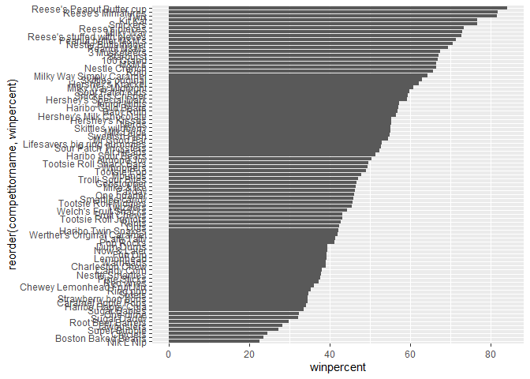
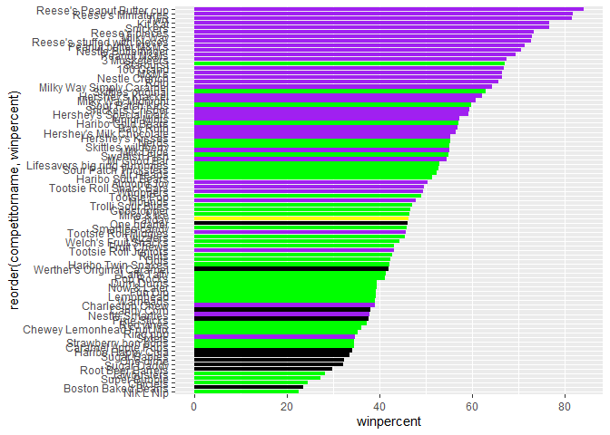
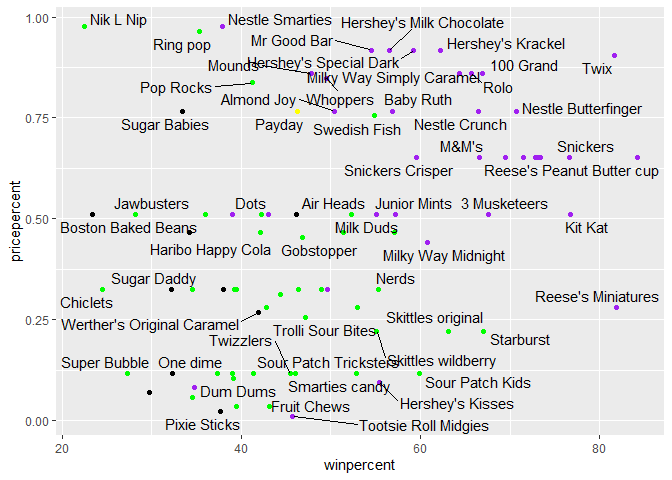
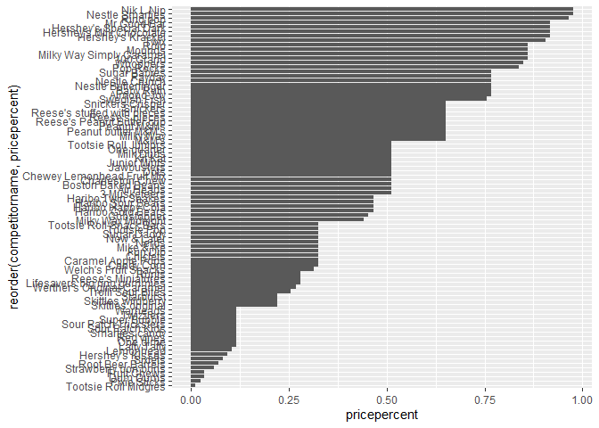
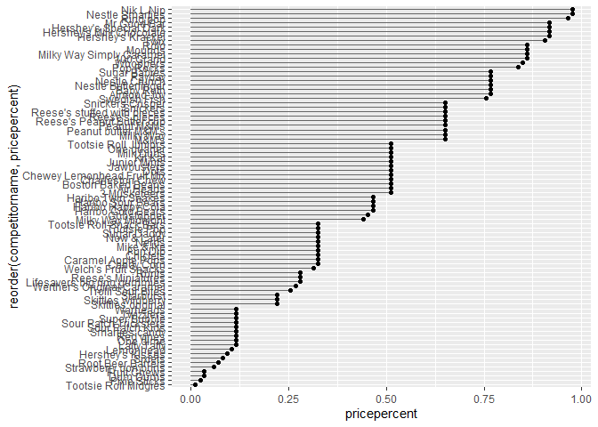
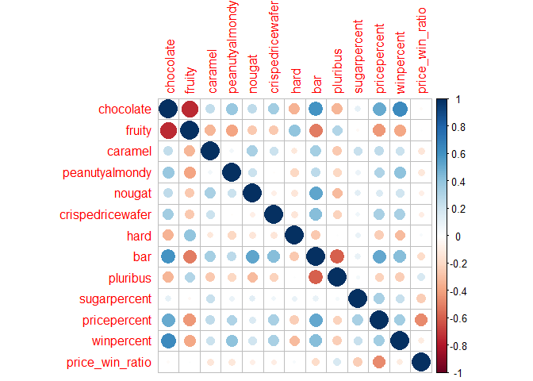
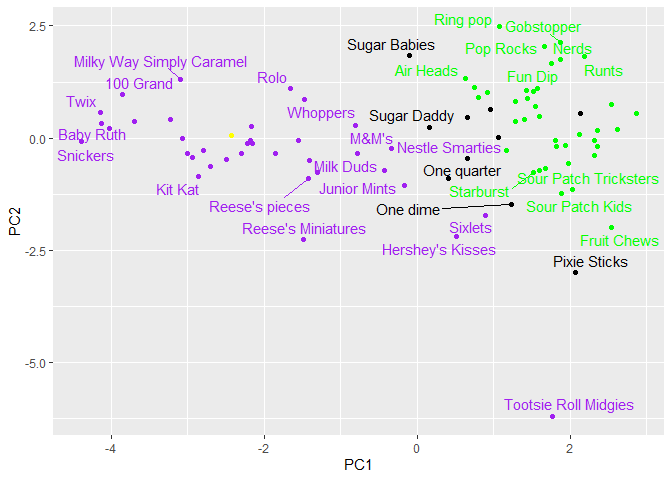
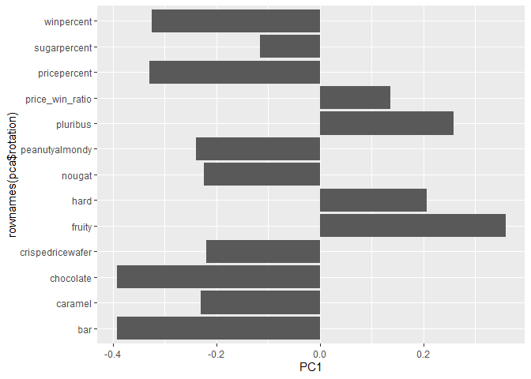

# Class10_Candy_Analysis
Qihao_Liu_U08901197

- [Background](#background)
- [Data import](#data-import)
- [What is your favorite candy?](#what-is-your-favorite-candy)
- [quick overview of dataset](#quick-overview-of-dataset)
- [Candy Ranking](#candy-ranking)
- [Winpercent and Pricepercent](#winpercent-and-pricepercent)
- [Exploring the correlation
  structure](#exploring-the-correlation-structure)
- [PCA](#pca)

## Background

Since it’s close to Halloween, and the half way point in the quarter,
let’s do a mini project to help us figure out the best candy to buy

Our data come from 538 website and is available as a CSV file

## Data import

First get the CSV file

``` r
url <- "https://raw.githubusercontent.com/fivethirtyeight/data/master/candy-power-ranking/candy-data.csv"

library("tidyverse")
```

    ── Attaching core tidyverse packages ──────────────────────── tidyverse 2.0.0 ──
    ✔ dplyr     1.1.4     ✔ readr     2.1.5
    ✔ forcats   1.0.1     ✔ stringr   1.6.0
    ✔ ggplot2   4.0.0     ✔ tibble    3.3.0
    ✔ lubridate 1.9.4     ✔ tidyr     1.3.1
    ✔ purrr     1.2.0     
    ── Conflicts ────────────────────────────────────────── tidyverse_conflicts() ──
    ✖ dplyr::filter() masks stats::filter()
    ✖ dplyr::lag()    masks stats::lag()
    ℹ Use the conflicted package (<http://conflicted.r-lib.org/>) to force all conflicts to become errors

``` r
candy <- read_csv(url)
```

    Rows: 85 Columns: 13
    ── Column specification ────────────────────────────────────────────────────────
    Delimiter: ","
    chr  (1): competitorname
    dbl (12): chocolate, fruity, caramel, peanutyalmondy, nougat, crispedricewaf...

    ℹ Use `spec()` to retrieve the full column specification for this data.
    ℹ Specify the column types or set `show_col_types = FALSE` to quiet this message.

``` r
flextable::flextable(head(candy,10))
```


> Q1. How many different candy types are in this dataset?

> A1: There are 85 candy types in this dataset

``` r
nrow(candy)
```

    [1] 85

``` r
#OR we can also do (Require tydiverse)

candy |> # Note that `|>` is the same as `%>%`
  nrow()
```

    [1] 85

> Q2. How many fruity candy types are in the dataset

> A2: There are 38 fruity types in the dataset

``` r
nrow(
  candy %>%
  filter(fruity == 1)
)
```

    [1] 38

``` r
head (
  candy %>%
  filter(fruity == 1)
)
```

    # A tibble: 6 × 13
      competitorname chocolate fruity caramel peanutyalmondy nougat crispedricewafer
      <chr>              <dbl>  <dbl>   <dbl>          <dbl>  <dbl>            <dbl>
    1 Air Heads              0      1       0              0      0                0
    2 Caramel Apple…         0      1       1              0      0                0
    3 Chewey Lemonh…         0      1       0              0      0                0
    4 Chiclets               0      1       0              0      0                0
    5 Dots                   0      1       0              0      0                0
    6 Dum Dums               0      1       0              0      0                0
    # ℹ 6 more variables: hard <dbl>, bar <dbl>, pluribus <dbl>,
    #   sugarpercent <dbl>, pricepercent <dbl>, winpercent <dbl>

## What is your favorite candy?

To access the win percent of a candy use the following code

``` r
library(dplyr)
candy %>%
  filter(competitorname == "Twix") %>%
  select(winpercent)
```

    # A tibble: 1 × 1
      winpercent
           <dbl>
    1       81.6

``` r
candy_winpercent <- function(x){
  candy %>%
  filter(competitorname == x) %>%
  select(winpercent)
}
```

> Q3. What is your favorite candy in the dataset and what is it’s
> winpercent value?

> A3: Its haribro happy cola , win rate is 34.158958

> Q4. What is the winpercent value for “Kit Kat”?

> A4:win rate is 76.7686

> Q5. What is the winpercent value for “Tootsie Roll Snack Bars”?

> A4:win rate is 49.653503

## quick overview of dataset

Using the skim function to skim the dataset

``` r
skimr::skim(candy)
```

|                                                  |       |
|:-------------------------------------------------|:------|
| Name                                             | candy |
| Number of rows                                   | 85    |
| Number of columns                                | 13    |
| \_\_\_\_\_\_\_\_\_\_\_\_\_\_\_\_\_\_\_\_\_\_\_   |       |
| Column type frequency:                           |       |
| character                                        | 1     |
| numeric                                          | 12    |
| \_\_\_\_\_\_\_\_\_\_\_\_\_\_\_\_\_\_\_\_\_\_\_\_ |       |
| Group variables                                  | None  |

Data summary

**Variable type: character**

| skim_variable  | n_missing | complete_rate | min | max | empty | n_unique | whitespace |
|:---------------|----------:|--------------:|----:|----:|------:|---------:|-----------:|
| competitorname |         0 |             1 |   4 |  27 |     0 |       85 |          0 |

**Variable type: numeric**

| skim_variable | n_missing | complete_rate | mean | sd | p0 | p25 | p50 | p75 | p100 | hist |
|:---|---:|---:|---:|---:|---:|---:|---:|---:|---:|:---|
| chocolate | 0 | 1 | 0.44 | 0.50 | 0.00 | 0.00 | 0.00 | 1.00 | 1.00 | ▇▁▁▁▆ |
| fruity | 0 | 1 | 0.45 | 0.50 | 0.00 | 0.00 | 0.00 | 1.00 | 1.00 | ▇▁▁▁▆ |
| caramel | 0 | 1 | 0.16 | 0.37 | 0.00 | 0.00 | 0.00 | 0.00 | 1.00 | ▇▁▁▁▂ |
| peanutyalmondy | 0 | 1 | 0.16 | 0.37 | 0.00 | 0.00 | 0.00 | 0.00 | 1.00 | ▇▁▁▁▂ |
| nougat | 0 | 1 | 0.08 | 0.28 | 0.00 | 0.00 | 0.00 | 0.00 | 1.00 | ▇▁▁▁▁ |
| crispedricewafer | 0 | 1 | 0.08 | 0.28 | 0.00 | 0.00 | 0.00 | 0.00 | 1.00 | ▇▁▁▁▁ |
| hard | 0 | 1 | 0.18 | 0.38 | 0.00 | 0.00 | 0.00 | 0.00 | 1.00 | ▇▁▁▁▂ |
| bar | 0 | 1 | 0.25 | 0.43 | 0.00 | 0.00 | 0.00 | 0.00 | 1.00 | ▇▁▁▁▂ |
| pluribus | 0 | 1 | 0.52 | 0.50 | 0.00 | 0.00 | 1.00 | 1.00 | 1.00 | ▇▁▁▁▇ |
| sugarpercent | 0 | 1 | 0.48 | 0.28 | 0.01 | 0.22 | 0.47 | 0.73 | 0.99 | ▇▇▇▇▆ |
| pricepercent | 0 | 1 | 0.47 | 0.29 | 0.01 | 0.26 | 0.47 | 0.65 | 0.98 | ▇▇▇▇▆ |
| winpercent | 0 | 1 | 50.32 | 14.71 | 22.45 | 39.14 | 47.83 | 59.86 | 84.18 | ▃▇▆▅▂ |

Note that from the skim function we can see that the variance within the
winpercent variable is very large (remeber to scale this value prior to
our PCA analysis)

> Q6:Is there any variable/column that looks to be on a different scale
> to the majority of the other columns in the dataset?

> A6: The winpercent is on a 0-100 scale and the rest are 0-1 scale

> Q7:What do you think a zero and one represent for the candy\$chocolate
> column?

> A7: That the candy does not have chocolate in it

> Q8:Plot a histogram of winpercent values

``` r
library(ggplot2)
ggplot(candy,aes(x=winpercent))+
  geom_histogram(bins=20)
```


> Q9. Is the distribution of winpercent values symmetrical?

> A9: It is not symmetrical

> Q10: Is the center of the distribution above or below 50%?

> A10: We can see the peak is clearly below 50, but the mean is
> 50.3167638 so we can use median to represent this distribution, which
> is 47.83

``` r
summary(candy$winpercent)
```

       Min. 1st Qu.  Median    Mean 3rd Qu.    Max. 
      22.45   39.14   47.83   50.32   59.86   84.18 

> Q11. On average is chocolate candy higher or lower ranked than fruit
> candy?

``` r
#1. Find all chocolate candy in the dataset
#2. Find their winpercent value
#3. calculate the mean of these winpercent
#4. repeat the above steps for fruity candy and compare

Choco.inds <- candy$chocolate==1
Choco.win <- candy[Choco.inds,]$winpercent
Choco.mean <- mean(Choco.win)
Choco.mean
```

    [1] 60.92153

``` r
fru.inds <- candy$fruity==1
fru.win <- candy[fru.inds,]$winpercent
fru.mean <- mean(fru.win)
fru.mean
```

    [1] 44.11974

``` r
#OR We can do

candy_chocolate <- candy %>%
  filter(chocolate == 1) %>%
  select(winpercent)

mean(candy_chocolate$winpercent)
```

    [1] 60.92153

``` r
candy_fruity <- candy %>%
  filter(fruity == 1) %>%
  select(winpercent) 

mean(candy_fruity$winpercent)
```

    [1] 44.11974

> A11: On average, the mean win percentage of chocolate candy is
> 60.9215294 while the mean win percentage of fruity candy is 44.1197414

> Q12: Is this difference significant?

> A12: we are gonna use the ttest function. Yes, the difference is
> significant (p-value = 2.871e-08)

``` r
t.test(Choco.win, fru.win)
```


        Welch Two Sample t-test

    data:  Choco.win and fru.win
    t = 6.2582, df = 68.882, p-value = 2.871e-08
    alternative hypothesis: true difference in means is not equal to 0
    95 percent confidence interval:
     11.44563 22.15795
    sample estimates:
    mean of x mean of y 
     60.92153  44.11974 

## Candy Ranking

> Q13. What are the five least liked candy types in this set?

> A13: They are Snickers, Kit Kat, Twix, Reese’s Miniatures, Reese’s
> Peanut Butter cup

``` r
x <- c(5,1,3,4)
sort(x)
```

    [1] 1 3 4 5

``` r
order(x) # gives the position of the numbers in the order
```

    [1] 2 3 4 1

``` r
ord.ind <- order(candy$winpercent)
head(candy[ord.ind,],5)
```

    # A tibble: 5 × 13
      competitorname chocolate fruity caramel peanutyalmondy nougat crispedricewafer
      <chr>              <dbl>  <dbl>   <dbl>          <dbl>  <dbl>            <dbl>
    1 Nik L Nip              0      1       0              0      0                0
    2 Boston Baked …         0      0       0              1      0                0
    3 Chiclets               0      1       0              0      0                0
    4 Super Bubble           0      1       0              0      0                0
    5 Jawbusters             0      1       0              0      0                0
    # ℹ 6 more variables: hard <dbl>, bar <dbl>, pluribus <dbl>,
    #   sugarpercent <dbl>, pricepercent <dbl>, winpercent <dbl>

``` r
#If we write everything in one line, we get: 
tail(candy[order(candy$winpercent),], n=5)
```

    # A tibble: 5 × 13
      competitorname chocolate fruity caramel peanutyalmondy nougat crispedricewafer
      <chr>              <dbl>  <dbl>   <dbl>          <dbl>  <dbl>            <dbl>
    1 Snickers               1      0       1              1      1                0
    2 Kit Kat                1      0       0              0      0                1
    3 Twix                   1      0       1              0      0                1
    4 Reese's Minia…         1      0       0              1      0                0
    5 Reese's Peanu…         1      0       0              1      0                0
    # ℹ 6 more variables: hard <dbl>, bar <dbl>, pluribus <dbl>,
    #   sugarpercent <dbl>, pricepercent <dbl>, winpercent <dbl>

``` r
#OR WE CAN DO
candy %>% 
  arrange(desc(winpercent)) %>% 
  head(5)
```

    # A tibble: 5 × 13
      competitorname chocolate fruity caramel peanutyalmondy nougat crispedricewafer
      <chr>              <dbl>  <dbl>   <dbl>          <dbl>  <dbl>            <dbl>
    1 Reese's Peanu…         1      0       0              1      0                0
    2 Reese's Minia…         1      0       0              1      0                0
    3 Twix                   1      0       1              0      0                1
    4 Kit Kat                1      0       0              0      0                1
    5 Snickers               1      0       1              1      1                0
    # ℹ 6 more variables: hard <dbl>, bar <dbl>, pluribus <dbl>,
    #   sugarpercent <dbl>, pricepercent <dbl>, winpercent <dbl>

> Q14. What are the top 5 all time favorite candy types out of this set?

> A14: They are Nik L Nip, Boston Baked Beans, Chiclets, Super Bubble,
> Jawbusters

``` r
candy %>% 
  arrange(winpercent) %>% 
  head(5)
```

    # A tibble: 5 × 13
      competitorname chocolate fruity caramel peanutyalmondy nougat crispedricewafer
      <chr>              <dbl>  <dbl>   <dbl>          <dbl>  <dbl>            <dbl>
    1 Nik L Nip              0      1       0              0      0                0
    2 Boston Baked …         0      0       0              1      0                0
    3 Chiclets               0      1       0              0      0                0
    4 Super Bubble           0      1       0              0      0                0
    5 Jawbusters             0      1       0              0      0                0
    # ℹ 6 more variables: hard <dbl>, bar <dbl>, pluribus <dbl>,
    #   sugarpercent <dbl>, pricepercent <dbl>, winpercent <dbl>

> Q15. Make a first barplot of candy ranking based on winpercent values.

``` r
ggplot(candy, aes(y=competitorname,x=winpercent))+
  geom_col()
```


> Q16. This is quite ugly, use the reorder() function to get the bars
> sorted by winpercent?

``` r
ggplot(candy, aes(y=reorder(competitorname,winpercent),x=winpercent))+
  geom_col()
```



Time to add some useful color

``` r
my_cols=rep("black", nrow(candy))
my_cols[as.logical(candy$bar)] = "yellow"
my_cols[as.logical(candy$chocolate)] = "purple" 
#Note that in this code, if we have a chocolate bar, its gonna get colored yellow first, then red, making the final color red because the code overwrite itself
my_cols[as.logical(candy$fruity)] = "green"
ggplot(candy) + 
  aes(winpercent, reorder(competitorname,winpercent)) +
  geom_col(fill=my_cols) 
```



Now, for the first time, using this plot we can answer questions like:
\>Q17. What is the worst ranked chocolate candy?

> A17: sixlet

> Q18. What is the best ranked fruity candy?

> A18: starbust

## Winpercent and Pricepercent

Now let’s plot the winpercent and the price percent at the same time

``` r
library(ggrepel)
ggplot(candy, aes(x = winpercent, y = pricepercent, label = competitorname))+
  geom_point(col=my_cols)+
  geom_text_repel()
```

    Warning: ggrepel: 29 unlabeled data points (too many overlaps). Consider
    increasing max.overlaps



We can see that chocolate candy tends to be more expensive, and the
fruity one is less expensive and less popular

> Q19. Which candy type is the highest ranked in terms of winpercent for
> the least money - i.e. offers the most bang for your buck?

> A19: Tootsie Roll Midgies

``` r
candy$price_win_ratio <- candy$winpercent / candy$pricepercent
best <- candy[which.max(candy$price_win_ratio), ]
best
```

    # A tibble: 1 × 14
      competitorname chocolate fruity caramel peanutyalmondy nougat crispedricewafer
      <chr>              <dbl>  <dbl>   <dbl>          <dbl>  <dbl>            <dbl>
    1 Tootsie Roll …         1      0       0              0      0                0
    # ℹ 7 more variables: hard <dbl>, bar <dbl>, pluribus <dbl>,
    #   sugarpercent <dbl>, pricepercent <dbl>, winpercent <dbl>,
    #   price_win_ratio <dbl>

> Q20. What are the top 5 most expensive candy types in the dataset and
> of these which is the least popular?

> A20: The top 5 most expensive candy type are NiK L Nip, Nestle
> Smarties, Ring pop, Hersheys Krackel, and Hersheys Milk Chocolate. Of
> these the least popular is the Nik L Nip

``` r
ord <- order(candy$pricepercent, decreasing = TRUE)
head( candy[ord,c(11,12)], n=5 )
```

    # A tibble: 5 × 2
      sugarpercent pricepercent
             <dbl>        <dbl>
    1        0.197        0.976
    2        0.267        0.976
    3        0.732        0.965
    4        0.430        0.918
    5        0.430        0.918

> Q21. Make a barplot again with geom_col() this time using pricepercent
> and then improve this step by step, first ordering the x-axis by value
> and finally making a so called “dot chat” or “lollipop” chart by
> swapping geom_col() for geom_point() + geom_segment().

``` r
ggplot(candy, aes(y=reorder(competitorname,pricepercent),x=pricepercent))+
  geom_col()
```



``` r
# Make a lollipop chart of pricepercent
ggplot(candy) +
  aes(pricepercent, reorder(competitorname, pricepercent)) +
  geom_segment(aes(yend = reorder(competitorname, pricepercent), 
                   xend = 0), col="gray40") +
    geom_point()
```



## Exploring the correlation structure

Now we are gonna try to calculate the correlation between all of the
columns of our dataset

``` r
library(corrplot)
```

    corrplot 0.95 loaded

``` r
cij <- cor(candy[,-1])
cij
```

                       chocolate      fruity     caramel peanutyalmondy      nougat
    chocolate         1.00000000 -0.74172106  0.24987535     0.37782357  0.25489183
    fruity           -0.74172106  1.00000000 -0.33548538    -0.39928014 -0.26936712
    caramel           0.24987535 -0.33548538  1.00000000     0.05935614  0.32849280
    peanutyalmondy    0.37782357 -0.39928014  0.05935614     1.00000000  0.21311310
    nougat            0.25489183 -0.26936712  0.32849280     0.21311310  1.00000000
    crispedricewafer  0.34120978 -0.26936712  0.21311310    -0.01764631 -0.08974359
    hard             -0.34417691  0.39067750 -0.12235513    -0.20555661 -0.13867505
    bar               0.59742114 -0.51506558  0.33396002     0.26041960  0.52297636
    pluribus         -0.33967519  0.29972522 -0.26958501    -0.20610932 -0.31033884
    sugarpercent      0.10416906 -0.03439296  0.22193335     0.08788927  0.12308135
    pricepercent      0.50467535 -0.43096853  0.25432709     0.30915323  0.15319643
    winpercent        0.63651675 -0.38093814  0.21341630     0.40619220  0.19937530
    price_win_ratio  -0.02971799  0.01128280 -0.13556801    -0.12892537 -0.08906992
                     crispedricewafer        hard         bar    pluribus
    chocolate              0.34120978 -0.34417691  0.59742114 -0.33967519
    fruity                -0.26936712  0.39067750 -0.51506558  0.29972522
    caramel                0.21311310 -0.12235513  0.33396002 -0.26958501
    peanutyalmondy        -0.01764631 -0.20555661  0.26041960 -0.20610932
    nougat                -0.08974359 -0.13867505  0.52297636 -0.31033884
    crispedricewafer       1.00000000 -0.13867505  0.42375093 -0.22469338
    hard                  -0.13867505  1.00000000 -0.26516504  0.01453172
    bar                    0.42375093 -0.26516504  1.00000000 -0.59340892
    pluribus              -0.22469338  0.01453172 -0.59340892  1.00000000
    sugarpercent           0.06994969  0.09180975  0.09998516  0.04552282
    pricepercent           0.32826539 -0.24436534  0.51840654 -0.22079363
    winpercent             0.32467965 -0.31038158  0.42992933 -0.24744787
    price_win_ratio       -0.09666726  0.03379455 -0.18297628  0.16685463
                     sugarpercent pricepercent winpercent price_win_ratio
    chocolate          0.10416906    0.5046754  0.6365167     -0.02971799
    fruity            -0.03439296   -0.4309685 -0.3809381      0.01128280
    caramel            0.22193335    0.2543271  0.2134163     -0.13556801
    peanutyalmondy     0.08788927    0.3091532  0.4061922     -0.12892537
    nougat             0.12308135    0.1531964  0.1993753     -0.08906992
    crispedricewafer   0.06994969    0.3282654  0.3246797     -0.09666726
    hard               0.09180975   -0.2443653 -0.3103816      0.03379455
    bar                0.09998516    0.5184065  0.4299293     -0.18297628
    pluribus           0.04552282   -0.2207936 -0.2474479      0.16685463
    sugarpercent       1.00000000    0.3297064  0.2291507     -0.24406690
    pricepercent       0.32970639    1.0000000  0.3453254     -0.47180948
    winpercent         0.22915066    0.3453254  1.0000000     -0.10863087
    price_win_ratio   -0.24406690   -0.4718095 -0.1086309      1.00000000

``` r
corrplot(cij)
```



> Q22. Examining this plot what two variables are anti-correlated
> (i.e. have minus values)?

> A22: Chocolate and fruity, because if a candy is chocolate it is made
> of chocolate and not fruit.

> Q23. Similarly, what two variables are most positively correlated?

> A23: Chocolate and price & chocolate and bar

## PCA

Recall function to use here is `prcomp` with the optional scale argument

``` r
pca <- prcomp(candy[,-1],scale=TRUE)
summary(pca)
```

    Importance of components:
                              PC1    PC2     PC3    PC4     PC5     PC6     PC7
    Standard deviation     2.0938 1.2127 1.13054 1.0787 0.98027 0.93656 0.81530
    Proportion of Variance 0.3372 0.1131 0.09832 0.0895 0.07392 0.06747 0.05113
    Cumulative Proportion  0.3372 0.4503 0.54866 0.6382 0.71208 0.77956 0.83069
                               PC8     PC9    PC10    PC11    PC12    PC13
    Standard deviation     0.78462 0.68466 0.66328 0.57829 0.43128 0.39534
    Proportion of Variance 0.04736 0.03606 0.03384 0.02572 0.01431 0.01202
    Cumulative Proportion  0.87804 0.91410 0.94794 0.97367 0.98798 1.00000

``` r
pca
```

    Standard deviations (1, .., p=13):
     [1] 2.0937535 1.2127184 1.1305394 1.0786777 0.9802705 0.9365644 0.8153036
     [8] 0.7846165 0.6846599 0.6632822 0.5782857 0.4312832 0.3953445

    Rotation (n x k) = (13 x 13):
                            PC1          PC2         PC3           PC4         PC5
    chocolate        -0.3924439 -0.219448144  0.15058469 -0.0114250051 -0.07105041
    fruity            0.3588085  0.265751128 -0.06419261 -0.0414216903  0.10444609
    caramel          -0.2293954  0.185201638 -0.29188009 -0.1131639560 -0.51223340
    peanutyalmondy   -0.2389173 -0.112739803  0.13689124  0.5237380179  0.27665942
    nougat           -0.2241826  0.022531785 -0.55962535  0.3358934505 -0.14260284
    crispedricewafer -0.2195121  0.039093933  0.22057443 -0.6773790754 -0.03722188
    hard              0.2059573  0.320563450 -0.26209629 -0.1224691573  0.06236033
    bar              -0.3912663 -0.004827650 -0.25701611 -0.1634667675  0.12009145
    pluribus          0.2590791 -0.002370332  0.46082634  0.2144772981 -0.38079984
    sugarpercent     -0.1161206  0.548733387  0.16560684  0.2005637175 -0.46041761
    pricepercent     -0.3299041  0.311975067  0.25547945 -0.0007214477  0.16401024
    winpercent       -0.3250778 -0.075548141  0.24143214  0.0768869968 -0.11815717
    price_win_ratio   0.1359085 -0.570297097 -0.09663968 -0.0743019060 -0.45522982
                              PC6           PC7         PC8          PC9
    chocolate         0.168012098 -0.0820264438 -0.22902045 -0.356733735
    fruity            0.070137283  0.4628654891  0.27452454  0.094856568
    caramel          -0.244254122 -0.4325648105  0.48368965  0.006498170
    peanutyalmondy    0.283589046 -0.2543683871  0.30643273  0.537530170
    nougat           -0.132132306  0.3641241953 -0.19720243  0.245456190
    crispedricewafer  0.080758716  0.1328929581  0.09283457  0.530877726
    hard              0.660819574 -0.3168714332 -0.18487010  0.009347836
    bar              -0.003492824  0.2356475753 -0.24112853  0.147918692
    pluribus         -0.219240043  0.0395262256 -0.20700502  0.282258901
    sugarpercent      0.267637811  0.1460393254 -0.16224957 -0.007795535
    pricepercent     -0.166682572 -0.1579120355 -0.34578465  0.047548219
    winpercent        0.333724015  0.4161740441  0.42330437 -0.307143205
    price_win_ratio   0.327480160 -0.0007099284 -0.19123968  0.185435980
                             PC10        PC11        PC12        PC13
    chocolate         0.204343511  0.03055033  0.04150283  0.71477134
    fruity           -0.010883670 -0.48239113  0.05817828  0.49412325
    caramel           0.096671412 -0.21146289  0.10638886  0.08089608
    peanutyalmondy   -0.089075185 -0.01744526  0.08152461  0.13332819
    nougat            0.297846590  0.13181443 -0.38006014  0.05637103
    crispedricewafer  0.081590021  0.24987963 -0.21829437  0.10012004
    hard              0.429260577 -0.02949363  0.03199238 -0.09862215
    bar              -0.057997495 -0.16266859  0.74322586 -0.14802838
    pluribus          0.517349972 -0.02681627  0.29738048 -0.02339919
    sugarpercent     -0.478913585  0.22932098  0.04480374  0.04974921
    pricepercent     -0.002069487 -0.62192962 -0.34680471 -0.14157619
    winpercent        0.289101852 -0.12797561 -0.06613302 -0.38474323
    price_win_ratio  -0.277946525 -0.39713642 -0.12779672 -0.06847945

Our main PCA result figure

``` r
pca <- prcomp(select(candy, where(is.numeric)), scale. = TRUE)

pca_scores <- as.data.frame(pca$x) %>%
  mutate(competitorname = candy$competitorname)

# Plot
ggplot(pca_scores, aes(x = PC1, y = PC2, label = competitorname)) +
  geom_point(color = my_cols) +
  geom_text_repel(color = my_cols)
```

    Warning: ggrepel: 52 unlabeled data points (too many overlaps). Consider
    increasing max.overlaps



We can see separation of fruity candy (green) vs chocolate candy
(purple)

we should examine the variable “loadings” or contribution

``` r
pca$rotation
```

                            PC1          PC2         PC3           PC4         PC5
    chocolate        -0.3924439 -0.219448144  0.15058469 -0.0114250051 -0.07105041
    fruity            0.3588085  0.265751128 -0.06419261 -0.0414216903  0.10444609
    caramel          -0.2293954  0.185201638 -0.29188009 -0.1131639560 -0.51223340
    peanutyalmondy   -0.2389173 -0.112739803  0.13689124  0.5237380179  0.27665942
    nougat           -0.2241826  0.022531785 -0.55962535  0.3358934505 -0.14260284
    crispedricewafer -0.2195121  0.039093933  0.22057443 -0.6773790754 -0.03722188
    hard              0.2059573  0.320563450 -0.26209629 -0.1224691573  0.06236033
    bar              -0.3912663 -0.004827650 -0.25701611 -0.1634667675  0.12009145
    pluribus          0.2590791 -0.002370332  0.46082634  0.2144772981 -0.38079984
    sugarpercent     -0.1161206  0.548733387  0.16560684  0.2005637175 -0.46041761
    pricepercent     -0.3299041  0.311975067  0.25547945 -0.0007214477  0.16401024
    winpercent       -0.3250778 -0.075548141  0.24143214  0.0768869968 -0.11815717
    price_win_ratio   0.1359085 -0.570297097 -0.09663968 -0.0743019060 -0.45522982
                              PC6           PC7         PC8          PC9
    chocolate         0.168012098 -0.0820264438 -0.22902045 -0.356733735
    fruity            0.070137283  0.4628654891  0.27452454  0.094856568
    caramel          -0.244254122 -0.4325648105  0.48368965  0.006498170
    peanutyalmondy    0.283589046 -0.2543683871  0.30643273  0.537530170
    nougat           -0.132132306  0.3641241953 -0.19720243  0.245456190
    crispedricewafer  0.080758716  0.1328929581  0.09283457  0.530877726
    hard              0.660819574 -0.3168714332 -0.18487010  0.009347836
    bar              -0.003492824  0.2356475753 -0.24112853  0.147918692
    pluribus         -0.219240043  0.0395262256 -0.20700502  0.282258901
    sugarpercent      0.267637811  0.1460393254 -0.16224957 -0.007795535
    pricepercent     -0.166682572 -0.1579120355 -0.34578465  0.047548219
    winpercent        0.333724015  0.4161740441  0.42330437 -0.307143205
    price_win_ratio   0.327480160 -0.0007099284 -0.19123968  0.185435980
                             PC10        PC11        PC12        PC13
    chocolate         0.204343511  0.03055033  0.04150283  0.71477134
    fruity           -0.010883670 -0.48239113  0.05817828  0.49412325
    caramel           0.096671412 -0.21146289  0.10638886  0.08089608
    peanutyalmondy   -0.089075185 -0.01744526  0.08152461  0.13332819
    nougat            0.297846590  0.13181443 -0.38006014  0.05637103
    crispedricewafer  0.081590021  0.24987963 -0.21829437  0.10012004
    hard              0.429260577 -0.02949363  0.03199238 -0.09862215
    bar              -0.057997495 -0.16266859  0.74322586 -0.14802838
    pluribus          0.517349972 -0.02681627  0.29738048 -0.02339919
    sugarpercent     -0.478913585  0.22932098  0.04480374  0.04974921
    pricepercent     -0.002069487 -0.62192962 -0.34680471 -0.14157619
    winpercent        0.289101852 -0.12797561 -0.06613302 -0.38474323
    price_win_ratio  -0.277946525 -0.39713642 -0.12779672 -0.06847945

``` r
ggplot(pca$rotation,aes(PC1,rownames(pca$rotation)))+
  geom_col()
```



> Q24. What original variables are picked up strongly by PC1 in the
> positive direction? Do these make sense to you?

> A24: Fruity, hard, pluribus are picked up by PC1. This makese sense
> because they all describe the fruity candy, so if they all picked up
> by PC1 in the positive direction, it would allow us to group the
> fruity candy in a cluster.
