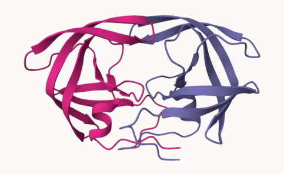
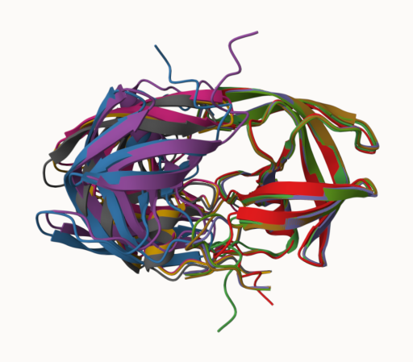
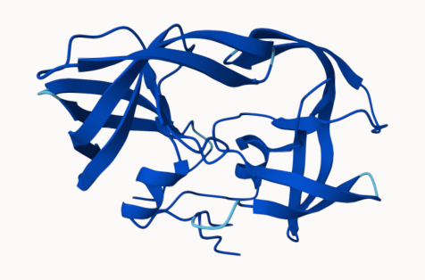
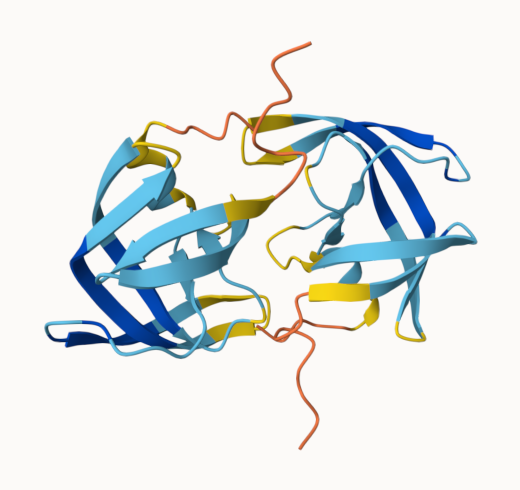
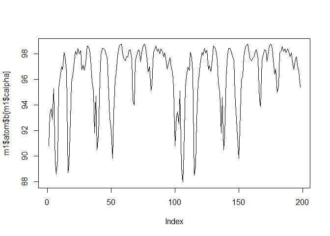
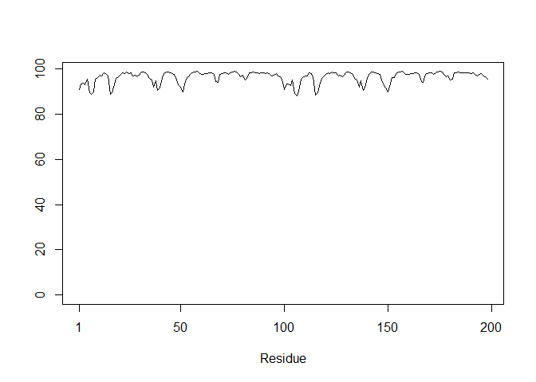
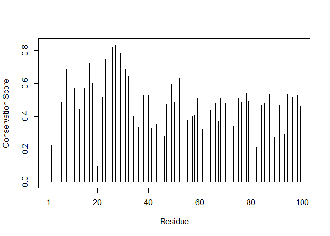
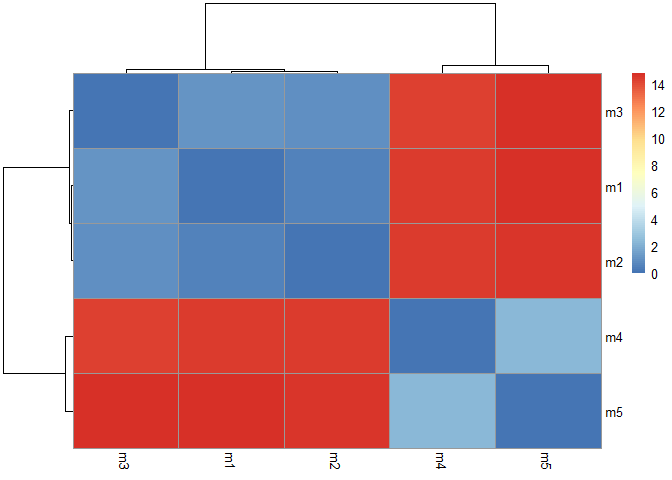
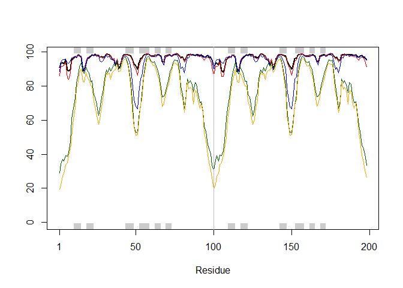
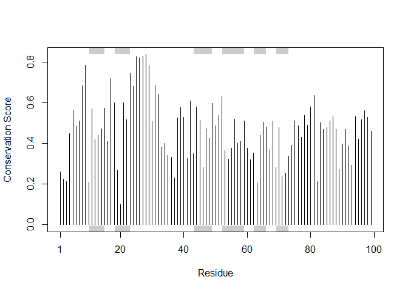

# Class11: Protein Structure Prediction


# Alpha Fold Data Base (AFDB)

The EBI maintain the largest database of AlphaFold structure prediction
models at https://alphafold.ebi.ac.uk/

Recall from previous class we saw that the PDB has 244,295 (Oct 2025)
protein structures

The total number of protein sequences in Uniport is 199,579,901

So PDB only has 0.12% structures because structure is inherently more
costly and time consuming then sequence determination.

> Key point: Only a tiny percentage of protein sequence has structural
> coverage (~0.12%)

AFDB is an attempt to address this issue

# Querying the AlphaFold database

There are two quality scores to consider:

1.  **pLDDT** stands for “predicted local distance difference test”. It
    is a measure of how well the method has converged (i.e., how well
    the predicted structure agrees with MSA and PDB structure
    information).

- If functional region is in a low pLDDT region, this specific model is
  useless

2.  **PAE** (predicted alignment score) measures the confidence in the
    relative position of the two residue. Increased error in PAE means
    decrease accuracy of prediction.

# Generating your own structure predictions

- Since our structure is not in alpha fold database, we are going to run
  our own structure predictions. (Note: When runing dimers, use ‘:’ to
  break up the chains)

- We removed spaces from the sequence when input it into the prediction
  program

- After completing the job, we can download the zip file containing all
  results

- Using Mol\*, we are going to superimpose all the predicted structures

The top model colored by chain:



Superimposed models (Model 1 vs Model 5):

 Superimposed models (all):



## Color by pLDDT

Top Model (Model 1):

 Bottom Model (Model 5):



# Custom analysis of resulting models

Read key result files into R. The first thing we need to know is that
what is the result’s directory/folder is called (Name is different for
each Alpha fold run)

``` r
results_dir <- "HIV_Pr_Dimer_23119.result/HIV_Pr_Dimer_23119/"

# File names for all PDB models
pdb_files <- list.files(path=results_dir,
                        pattern="*.pdb",
                        full.names = TRUE)

# Print our PDB file names
basename(pdb_files)
```

    [1] "HIV_Pr_Dimer_23119_unrelaxed_rank_001_alphafold2_multimer_v3_model_4_seed_000.pdb"
    [2] "HIV_Pr_Dimer_23119_unrelaxed_rank_002_alphafold2_multimer_v3_model_1_seed_000.pdb"
    [3] "HIV_Pr_Dimer_23119_unrelaxed_rank_003_alphafold2_multimer_v3_model_5_seed_000.pdb"
    [4] "HIV_Pr_Dimer_23119_unrelaxed_rank_004_alphafold2_multimer_v3_model_2_seed_000.pdb"
    [5] "HIV_Pr_Dimer_23119_unrelaxed_rank_005_alphafold2_multimer_v3_model_3_seed_000.pdb"

``` r
library(bio3d)
```

    Warning: package 'bio3d' was built under R version 4.5.2

``` r
# Read all data from Models 
#  and superpose/fit coords
# pdbs <- pdbaln(pdb_files, fit=TRUE, exefile="msa")

m1 <- read.pdb(pdb_files[1])
m1
```


     Call:  read.pdb(file = pdb_files[1])

       Total Models#: 1
         Total Atoms#: 1514,  XYZs#: 4542  Chains#: 2  (values: A B)

         Protein Atoms#: 1514  (residues/Calpha atoms#: 198)
         Nucleic acid Atoms#: 0  (residues/phosphate atoms#: 0)

         Non-protein/nucleic Atoms#: 0  (residues: 0)
         Non-protein/nucleic resid values: [ none ]

       Protein sequence:
          PQITLWQRPLVTIKIGGQLKEALLDTGADDTVLEEMSLPGRWKPKMIGGIGGFIKVRQYD
          QILIEICGHKAIGTVLVGPTPVNIIGRNLLTQIGCTLNFPQITLWQRPLVTIKIGGQLKE
          ALLDTGADDTVLEEMSLPGRWKPKMIGGIGGFIKVRQYDQILIEICGHKAIGTVLVGPTP
          VNIIGRNLLTQIGCTLNF

    + attr: atom, xyz, calpha, call

``` r
head(m1$atom$b)
```

    [1] 90.81 90.81 90.81 90.81 90.81 90.81

``` r
plot(m1$atom$b[m1$calpha],type="l")
```



``` r
plot.bio3d(m1$atom$b[m1$calpha],type="l")
```



This is the pLDDT score for model 1, we can see that the score is
consistently high throughout structure 1 (Note that the above two graphs
are the same graphs, the difference is the scale of the y-axis)

# Residue conservation from alignment file

``` r
aln_file <- list.files(path=results_dir,
                       pattern=".a3m$",
                        full.names = TRUE)
aln_file
```

    [1] "HIV_Pr_Dimer_23119.result/HIV_Pr_Dimer_23119/HIV_Pr_Dimer_23119.a3m"

Read this into R

``` r
aln <- read.fasta(aln_file[1], to.upper = TRUE)
```

    [1] " ** Duplicated sequence id's: 101 **"
    [2] " ** Duplicated sequence id's: 101 **"

``` r
dim(aln$ali)
```

    [1] 5397  132

Score Residue Conservation

``` r
sim <- conserv(aln)

plotb3(sim[1:99],ylab="Conservation Score")
```



From this graph, we can see that some positionsare highly conserved (AA
following AA-20). These are the functional bit of the protein

``` r
con <- consensus(aln,cutoff = 0.9)
con$seq
```

      [1] "-" "-" "-" "-" "-" "-" "-" "-" "-" "-" "-" "-" "-" "-" "-" "-" "-" "-"
     [19] "-" "-" "-" "-" "-" "-" "D" "T" "G" "A" "-" "-" "-" "-" "-" "-" "-" "-"
     [37] "-" "-" "-" "-" "-" "-" "-" "-" "-" "-" "-" "-" "-" "-" "-" "-" "-" "-"
     [55] "-" "-" "-" "-" "-" "-" "-" "-" "-" "-" "-" "-" "-" "-" "-" "-" "-" "-"
     [73] "-" "-" "-" "-" "-" "-" "-" "-" "-" "-" "-" "-" "-" "-" "-" "-" "-" "-"
     [91] "-" "-" "-" "-" "-" "-" "-" "-" "-" "-" "-" "-" "-" "-" "-" "-" "-" "-"
    [109] "-" "-" "-" "-" "-" "-" "-" "-" "-" "-" "-" "-" "-" "-" "-" "-" "-" "-"
    [127] "-" "-" "-" "-" "-" "-"

Now we can see the four digits that are crucial for this class of
molecule

# Homework

## Multiple Sequence Alignment

``` r
pdbs <- pdbaln(pdb_files, fit=TRUE, exefile="msa")
```

    Reading PDB files:
    HIV_Pr_Dimer_23119.result/HIV_Pr_Dimer_23119/HIV_Pr_Dimer_23119_unrelaxed_rank_001_alphafold2_multimer_v3_model_4_seed_000.pdb
    HIV_Pr_Dimer_23119.result/HIV_Pr_Dimer_23119/HIV_Pr_Dimer_23119_unrelaxed_rank_002_alphafold2_multimer_v3_model_1_seed_000.pdb
    HIV_Pr_Dimer_23119.result/HIV_Pr_Dimer_23119/HIV_Pr_Dimer_23119_unrelaxed_rank_003_alphafold2_multimer_v3_model_5_seed_000.pdb
    HIV_Pr_Dimer_23119.result/HIV_Pr_Dimer_23119/HIV_Pr_Dimer_23119_unrelaxed_rank_004_alphafold2_multimer_v3_model_2_seed_000.pdb
    HIV_Pr_Dimer_23119.result/HIV_Pr_Dimer_23119/HIV_Pr_Dimer_23119_unrelaxed_rank_005_alphafold2_multimer_v3_model_3_seed_000.pdb
    .....

    Extracting sequences

    pdb/seq: 1   name: HIV_Pr_Dimer_23119.result/HIV_Pr_Dimer_23119/HIV_Pr_Dimer_23119_unrelaxed_rank_001_alphafold2_multimer_v3_model_4_seed_000.pdb 
    pdb/seq: 2   name: HIV_Pr_Dimer_23119.result/HIV_Pr_Dimer_23119/HIV_Pr_Dimer_23119_unrelaxed_rank_002_alphafold2_multimer_v3_model_1_seed_000.pdb 
    pdb/seq: 3   name: HIV_Pr_Dimer_23119.result/HIV_Pr_Dimer_23119/HIV_Pr_Dimer_23119_unrelaxed_rank_003_alphafold2_multimer_v3_model_5_seed_000.pdb 
    pdb/seq: 4   name: HIV_Pr_Dimer_23119.result/HIV_Pr_Dimer_23119/HIV_Pr_Dimer_23119_unrelaxed_rank_004_alphafold2_multimer_v3_model_2_seed_000.pdb 
    pdb/seq: 5   name: HIV_Pr_Dimer_23119.result/HIV_Pr_Dimer_23119/HIV_Pr_Dimer_23119_unrelaxed_rank_005_alphafold2_multimer_v3_model_3_seed_000.pdb 

``` r
pdbs
```

                                   1        .         .         .         .         50 
    [Truncated_Name:1]HIV_Pr_Dim   PQITLWQRPLVTIKIGGQLKEALLDTGADDTVLEEMSLPGRWKPKMIGGI
    [Truncated_Name:2]HIV_Pr_Dim   PQITLWQRPLVTIKIGGQLKEALLDTGADDTVLEEMSLPGRWKPKMIGGI
    [Truncated_Name:3]HIV_Pr_Dim   PQITLWQRPLVTIKIGGQLKEALLDTGADDTVLEEMSLPGRWKPKMIGGI
    [Truncated_Name:4]HIV_Pr_Dim   PQITLWQRPLVTIKIGGQLKEALLDTGADDTVLEEMSLPGRWKPKMIGGI
    [Truncated_Name:5]HIV_Pr_Dim   PQITLWQRPLVTIKIGGQLKEALLDTGADDTVLEEMSLPGRWKPKMIGGI
                                   ************************************************** 
                                   1        .         .         .         .         50 

                                  51        .         .         .         .         100 
    [Truncated_Name:1]HIV_Pr_Dim   GGFIKVRQYDQILIEICGHKAIGTVLVGPTPVNIIGRNLLTQIGCTLNFP
    [Truncated_Name:2]HIV_Pr_Dim   GGFIKVRQYDQILIEICGHKAIGTVLVGPTPVNIIGRNLLTQIGCTLNFP
    [Truncated_Name:3]HIV_Pr_Dim   GGFIKVRQYDQILIEICGHKAIGTVLVGPTPVNIIGRNLLTQIGCTLNFP
    [Truncated_Name:4]HIV_Pr_Dim   GGFIKVRQYDQILIEICGHKAIGTVLVGPTPVNIIGRNLLTQIGCTLNFP
    [Truncated_Name:5]HIV_Pr_Dim   GGFIKVRQYDQILIEICGHKAIGTVLVGPTPVNIIGRNLLTQIGCTLNFP
                                   ************************************************** 
                                  51        .         .         .         .         100 

                                 101        .         .         .         .         150 
    [Truncated_Name:1]HIV_Pr_Dim   QITLWQRPLVTIKIGGQLKEALLDTGADDTVLEEMSLPGRWKPKMIGGIG
    [Truncated_Name:2]HIV_Pr_Dim   QITLWQRPLVTIKIGGQLKEALLDTGADDTVLEEMSLPGRWKPKMIGGIG
    [Truncated_Name:3]HIV_Pr_Dim   QITLWQRPLVTIKIGGQLKEALLDTGADDTVLEEMSLPGRWKPKMIGGIG
    [Truncated_Name:4]HIV_Pr_Dim   QITLWQRPLVTIKIGGQLKEALLDTGADDTVLEEMSLPGRWKPKMIGGIG
    [Truncated_Name:5]HIV_Pr_Dim   QITLWQRPLVTIKIGGQLKEALLDTGADDTVLEEMSLPGRWKPKMIGGIG
                                   ************************************************** 
                                 101        .         .         .         .         150 

                                 151        .         .         .         .       198 
    [Truncated_Name:1]HIV_Pr_Dim   GFIKVRQYDQILIEICGHKAIGTVLVGPTPVNIIGRNLLTQIGCTLNF
    [Truncated_Name:2]HIV_Pr_Dim   GFIKVRQYDQILIEICGHKAIGTVLVGPTPVNIIGRNLLTQIGCTLNF
    [Truncated_Name:3]HIV_Pr_Dim   GFIKVRQYDQILIEICGHKAIGTVLVGPTPVNIIGRNLLTQIGCTLNF
    [Truncated_Name:4]HIV_Pr_Dim   GFIKVRQYDQILIEICGHKAIGTVLVGPTPVNIIGRNLLTQIGCTLNF
    [Truncated_Name:5]HIV_Pr_Dim   GFIKVRQYDQILIEICGHKAIGTVLVGPTPVNIIGRNLLTQIGCTLNF
                                   ************************************************ 
                                 151        .         .         .         .       198 

    Call:
      pdbaln(files = pdb_files, fit = TRUE, exefile = "msa")

    Class:
      pdbs, fasta

    Alignment dimensions:
      5 sequence rows; 198 position columns (198 non-gap, 0 gap) 

    + attr: xyz, resno, b, chain, id, ali, resid, sse, call

## RMSD

a standard measure of structural distance between coordinate sets. We
will use `rsmd()` function to calculate the RMSD between all models

``` r
rd<- rmsd(pdbs,fit=T)
```

    Warning in rmsd(pdbs, fit = T): No indices provided, using the 198 non NA positions

``` r
range(rd)
```

    [1]  0.000 14.754

We can generate a heatmap of these RMSD matrix values

``` r
library(pheatmap)

colnames(rd) <- paste0("m",1:5)
rownames(rd) <- paste0("m",1:5)
pheatmap(rd)
```



In this graph, we can see that the model m1, m2 are more similar to each
other, and the model m4, m5 (and m3 to a lesser degree) are more similar
to each other

## Plotting the pLDDT values

First, let’s read a reference PDB structure

``` r
pdb <- read.pdb("1hsg")
```

      Note: Accessing on-line PDB file

``` r
plotb3(pdbs$b[1,], typ="l", lwd=2, sse=pdb)
points(pdbs$b[2,], typ="l", col="red")
points(pdbs$b[3,], typ="l", col="blue")
points(pdbs$b[4,], typ="l", col="darkgreen")
points(pdbs$b[5,], typ="l", col="orange")
abline(v=100, col="gray")
```



In this graph, we can see that model 1 and 2 has consistenly high pLDDT
scores across the structure, while models 3, 4, 5 has drastic decreases
in pLDDT scores in some regions

## RMSF (Root Mean Square Fluctuation Analysis)

We can improve the superposition/fitting of our models by finding the
most consistent “rigid core” common across all the models.

``` r
core <- core.find(pdbs)
```

     core size 197 of 198  vol = 9885.419 
     core size 196 of 198  vol = 6898.241 
     core size 195 of 198  vol = 1338.035 
     core size 194 of 198  vol = 1040.677 
     core size 193 of 198  vol = 951.865 
     core size 192 of 198  vol = 899.087 
     core size 191 of 198  vol = 834.733 
     core size 190 of 198  vol = 771.342 
     core size 189 of 198  vol = 733.069 
     core size 188 of 198  vol = 697.285 
     core size 187 of 198  vol = 659.748 
     core size 186 of 198  vol = 625.28 
     core size 185 of 198  vol = 589.548 
     core size 184 of 198  vol = 568.261 
     core size 183 of 198  vol = 545.022 
     core size 182 of 198  vol = 512.897 
     core size 181 of 198  vol = 490.731 
     core size 180 of 198  vol = 470.274 
     core size 179 of 198  vol = 450.738 
     core size 178 of 198  vol = 434.743 
     core size 177 of 198  vol = 420.345 
     core size 176 of 198  vol = 406.666 
     core size 175 of 198  vol = 393.341 
     core size 174 of 198  vol = 382.402 
     core size 173 of 198  vol = 372.866 
     core size 172 of 198  vol = 357.001 
     core size 171 of 198  vol = 346.576 
     core size 170 of 198  vol = 337.454 
     core size 169 of 198  vol = 326.668 
     core size 168 of 198  vol = 314.959 
     core size 167 of 198  vol = 304.136 
     core size 166 of 198  vol = 294.561 
     core size 165 of 198  vol = 285.658 
     core size 164 of 198  vol = 278.893 
     core size 163 of 198  vol = 266.773 
     core size 162 of 198  vol = 259.003 
     core size 161 of 198  vol = 247.731 
     core size 160 of 198  vol = 239.849 
     core size 159 of 198  vol = 234.973 
     core size 158 of 198  vol = 230.071 
     core size 157 of 198  vol = 221.995 
     core size 156 of 198  vol = 215.629 
     core size 155 of 198  vol = 206.8 
     core size 154 of 198  vol = 196.992 
     core size 153 of 198  vol = 188.547 
     core size 152 of 198  vol = 182.27 
     core size 151 of 198  vol = 176.961 
     core size 150 of 198  vol = 170.72 
     core size 149 of 198  vol = 166.128 
     core size 148 of 198  vol = 159.805 
     core size 147 of 198  vol = 153.775 
     core size 146 of 198  vol = 149.101 
     core size 145 of 198  vol = 143.664 
     core size 144 of 198  vol = 137.145 
     core size 143 of 198  vol = 132.523 
     core size 142 of 198  vol = 127.237 
     core size 141 of 198  vol = 121.579 
     core size 140 of 198  vol = 116.78 
     core size 139 of 198  vol = 112.575 
     core size 138 of 198  vol = 108.175 
     core size 137 of 198  vol = 105.137 
     core size 136 of 198  vol = 101.254 
     core size 135 of 198  vol = 97.379 
     core size 134 of 198  vol = 92.978 
     core size 133 of 198  vol = 88.188 
     core size 132 of 198  vol = 84.032 
     core size 131 of 198  vol = 81.902 
     core size 130 of 198  vol = 78.023 
     core size 129 of 198  vol = 75.276 
     core size 128 of 198  vol = 73.057 
     core size 127 of 198  vol = 70.699 
     core size 126 of 198  vol = 68.976 
     core size 125 of 198  vol = 66.707 
     core size 124 of 198  vol = 64.376 
     core size 123 of 198  vol = 61.145 
     core size 122 of 198  vol = 59.029 
     core size 121 of 198  vol = 56.625 
     core size 120 of 198  vol = 54.369 
     core size 119 of 198  vol = 51.826 
     core size 118 of 198  vol = 49.651 
     core size 117 of 198  vol = 48.19 
     core size 116 of 198  vol = 46.644 
     core size 115 of 198  vol = 44.748 
     core size 114 of 198  vol = 43.288 
     core size 113 of 198  vol = 41.089 
     core size 112 of 198  vol = 39.143 
     core size 111 of 198  vol = 36.468 
     core size 110 of 198  vol = 34.114 
     core size 109 of 198  vol = 31.467 
     core size 108 of 198  vol = 29.445 
     core size 107 of 198  vol = 27.323 
     core size 106 of 198  vol = 25.82 
     core size 105 of 198  vol = 24.149 
     core size 104 of 198  vol = 22.647 
     core size 103 of 198  vol = 21.068 
     core size 102 of 198  vol = 19.953 
     core size 101 of 198  vol = 18.3 
     core size 100 of 198  vol = 15.723 
     core size 99 of 198  vol = 14.841 
     core size 98 of 198  vol = 11.646 
     core size 97 of 198  vol = 9.435 
     core size 96 of 198  vol = 7.354 
     core size 95 of 198  vol = 6.181 
     core size 94 of 198  vol = 5.667 
     core size 93 of 198  vol = 4.706 
     core size 92 of 198  vol = 3.664 
     core size 91 of 198  vol = 2.77 
     core size 90 of 198  vol = 2.151 
     core size 89 of 198  vol = 1.715 
     core size 88 of 198  vol = 1.15 
     core size 87 of 198  vol = 0.874 
     core size 86 of 198  vol = 0.685 
     core size 85 of 198  vol = 0.528 
     core size 84 of 198  vol = 0.37 
     FINISHED: Min vol ( 0.5 ) reached

``` r
core.inds <- print(core, vol=0.5)
```

    # 85 positions (cumulative volume <= 0.5 Angstrom^3) 
      start end length
    1     9  49     41
    2    52  95     44

``` r
xyz <- pdbfit(pdbs, core.inds, outpath="corefit_structures")
```

``` r
rf <- rmsf(xyz)

plotb3(rf, sse=pdb)
abline(v=100, col="gray", ylab="RMSF")
```


By plotting the root mean square differences, we can see that the first
chain between the models are largely the same, and the second chain is
the one where different prediction varies

## Predicted Alignment Error for domains

AlphaFold produces an output called Predicted Aligned Error (PAE). we
can read these files and see that AlphaFold produces a useful
inter-domain prediction for model 1 but not for model 5

``` r
library(jsonlite)

# Listing of all PAE JSON files
pae_files <- list.files(path=results_dir,
                        pattern=".*model.*\\.json",
                        full.names = TRUE)
```

``` r
pae1 <- read_json(pae_files[1],simplifyVector = TRUE)
pae5 <- read_json(pae_files[5],simplifyVector = TRUE)
attributes(pae1)
```

    $names
    [1] "plddt"   "max_pae" "pae"     "ptm"     "iptm"   

``` r
head(pae1$plddt) 
```

    [1] 90.81 93.25 93.69 92.88 95.25 89.44

The maximum PAE values are useful for ranking models. Here we can see
that model 5 is much worse than model 1.

``` r
pae1$max_pae
```

    [1] 12.84375

``` r
pae5$max_pae
```

    [1] 29.59375

We can also plot PAE scores for each residue:

For model 1:

``` r
plot.dmat(pae1$pae, 
          xlab="Residue Position (i)",
          ylab="Residue Position (j)",
          grid.col = "black",
          zlim=c(0,30))
```


for Model 5:

``` r
plot.dmat(pae5$pae, 
          xlab="Residue Position (i)",
          ylab="Residue Position (j)",
          grid.col = "black",
          zlim=c(0,30))
```


Again, we can see that model 1 is much better than model 5

## Residue conservation from alignment file

``` r
aln_file <- list.files(path=results_dir,
                       pattern=".a3m$",
                        full.names = TRUE)
aln_file
```

    [1] "HIV_Pr_Dimer_23119.result/HIV_Pr_Dimer_23119/HIV_Pr_Dimer_23119.a3m"

``` r
aln <- read.fasta(aln_file[1], to.upper = TRUE)
```

    [1] " ** Duplicated sequence id's: 101 **"
    [2] " ** Duplicated sequence id's: 101 **"

``` r
dim(aln$ali)
```

    [1] 5397  132

``` r
sim <- conserv(aln)
plotb3(sim[1:99], sse=trim.pdb(pdb, chain="A"),
       ylab="Conservation Score")
```



``` r
con <- consensus(aln, cutoff = 0.9)
con$seq
```

      [1] "-" "-" "-" "-" "-" "-" "-" "-" "-" "-" "-" "-" "-" "-" "-" "-" "-" "-"
     [19] "-" "-" "-" "-" "-" "-" "D" "T" "G" "A" "-" "-" "-" "-" "-" "-" "-" "-"
     [37] "-" "-" "-" "-" "-" "-" "-" "-" "-" "-" "-" "-" "-" "-" "-" "-" "-" "-"
     [55] "-" "-" "-" "-" "-" "-" "-" "-" "-" "-" "-" "-" "-" "-" "-" "-" "-" "-"
     [73] "-" "-" "-" "-" "-" "-" "-" "-" "-" "-" "-" "-" "-" "-" "-" "-" "-" "-"
     [91] "-" "-" "-" "-" "-" "-" "-" "-" "-" "-" "-" "-" "-" "-" "-" "-" "-" "-"
    [109] "-" "-" "-" "-" "-" "-" "-" "-" "-" "-" "-" "-" "-" "-" "-" "-" "-" "-"
    [127] "-" "-" "-" "-" "-" "-"

we can see the four digits that are crucial for this class of molecule

``` r
m1.pdb <- read.pdb(pdb_files[1])
occ <- vec2resno(c(sim[1:99], sim[1:99]), m1.pdb$atom$resno)
write.pdb(m1.pdb, o=occ, file="m1_conserv.pdb")
```


