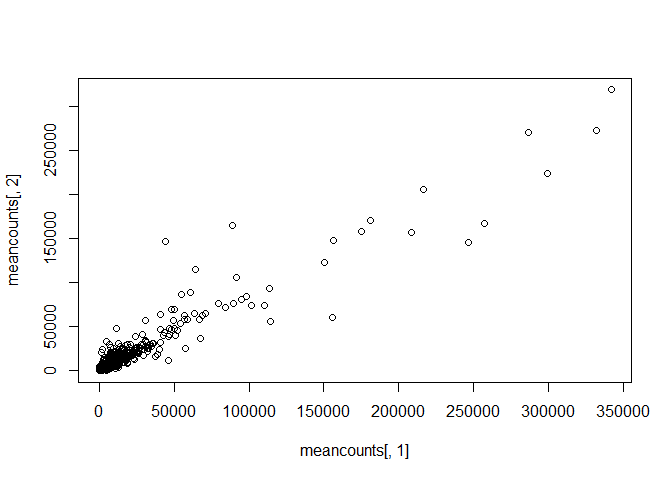
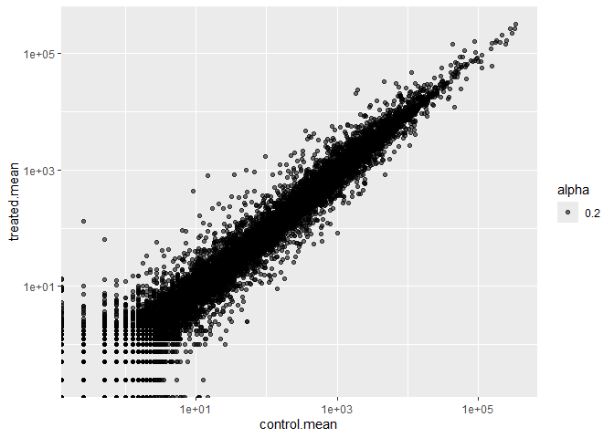
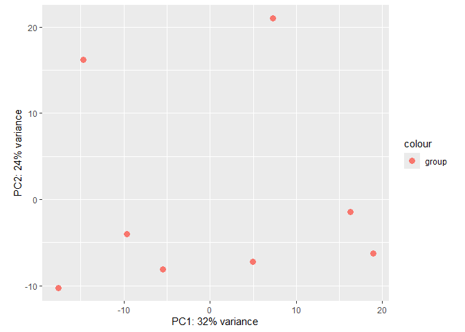
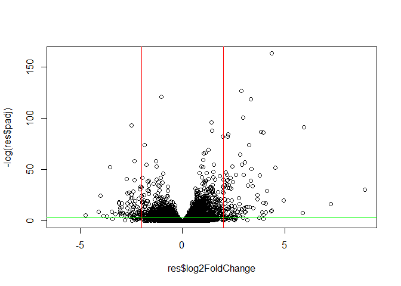

# Class12: Transcriptomics and the analysis of RNA-Seq data
Qihao Liu (U08901197)

# Background

The data for comes from a RNA-seq experiment where airway smooth muscle
cells were treated with dexamethasone (Athma), a synthetic
glucocorticoid steroid with anti-inflammatory effects. Drugs such as
this one also has potential to be repurposed to combat diseases such as
COVID-19.

To know why does it work and how does it work, we need to look into the
specific mechanism of this drug, like using RNA-seq to look at the gene
expression profile changes in the airway cells

Used Tophat and Cufflinks to quantify transcript abundance, and found
many differently expressed genes with or without drug treatment, Himes
et al focused on CRISPLD2 - SNPs in this gene associated with resistance
to inhaled corticosteriod treatment in asthma pts.

# Bioconductor setup

1st we need to install bioconductor package with commands
`install.packages("BiocManager")` and `BiocManager::install()`

-Note: Unlike normal CRAN packages, Bioc

Then we install DeSeq2 package (`BiocManager::install("DESeq2")`)

We can check to see if the packages are installed successfully

``` r
library(BiocManager)
library(DESeq2)
```

## DESeq2 Required Inputs

DeSeq2 requires 2 imput, counts and metadata, counts in this case is the
number of genes under each condition, metadata is called colData, which
describes how the data is set up(what each row contains, ie. for ctrl1
row in countData, Coldata would describe it as control for tx and male
for sex)

- strick 1:1 correspondence between countdata and metadata is required
  for proper comparisoin

# Import countData and colData

``` r
# Complete the missing code
counts <- read.csv("airway_scaledcounts.csv", row.names=1)
metadata <- read.csv("airway_metadata.csv")
```

Take a loot at the head of each

``` r
head(counts)
```

                    SRR1039508 SRR1039509 SRR1039512 SRR1039513 SRR1039516
    ENSG00000000003        723        486        904        445       1170
    ENSG00000000005          0          0          0          0          0
    ENSG00000000419        467        523        616        371        582
    ENSG00000000457        347        258        364        237        318
    ENSG00000000460         96         81         73         66        118
    ENSG00000000938          0          0          1          0          2
                    SRR1039517 SRR1039520 SRR1039521
    ENSG00000000003       1097        806        604
    ENSG00000000005          0          0          0
    ENSG00000000419        781        417        509
    ENSG00000000457        447        330        324
    ENSG00000000460         94        102         74
    ENSG00000000938          0          0          0

``` r
head(metadata)
```

              id     dex celltype     geo_id
    1 SRR1039508 control   N61311 GSM1275862
    2 SRR1039509 treated   N61311 GSM1275863
    3 SRR1039512 control  N052611 GSM1275866
    4 SRR1039513 treated  N052611 GSM1275867
    5 SRR1039516 control  N080611 GSM1275870
    6 SRR1039517 treated  N080611 GSM1275871

Note that the column names of the count data exactly matches the sample
IDs of the metadata sheet

A quick sanity check on correspondence of counts and metadata by
ensuring the metaData id corresponds to the colnames of countsData

``` r
metadata$id == colnames(counts)
```

    [1] TRUE TRUE TRUE TRUE TRUE TRUE TRUE TRUE

> Q1. How many genes are in this database

> A1. There are 38694 in this database

``` r
nrow(counts)
```

    [1] 38694

> Q2. How many control cell lines do we have

``` r
library(tidyverse)
nrow(
  metadata %>%
  filter(dex == "control")
)
```

    [1] 4

> A2. There are 4 control cell lines in this database

# Toy differential gene expression

Lets perform some **toy** exploratory differential gene expression
analysis. (**toy** as in we should never do differential expression
analysis this way)

Note that the **control** samples are SRR1039508, SRR1039512,
SRR1039516, and SRR1039520. we will calculate the mean counts per gene
across these **control** samples:

``` r
# we store all the control sample ids and information from the metadata into the control vector
control <- metadata[metadata[,"dex"]=="control",]
#Then we store all the gene counts under the control samples from the countData into the control.counts vector
control.counts <- counts[ ,control$id]
#We ask r to calculate the row sums of each control and dvided by the number of controlled samples (4)
control.mean <- rowSums( control.counts )/4 
head(control.mean)
```

    ENSG00000000003 ENSG00000000005 ENSG00000000419 ENSG00000000457 ENSG00000000460 
             900.75            0.00          520.50          339.75           97.25 
    ENSG00000000938 
               0.75 

An alternative way to do this is:

``` r
library(dplyr)
control <- metadata %>% filter(dex=="control")
control.counts <- counts %>% select(control$id) 
control.mean <- rowSums(control.counts)/4
head(control.mean)
```

    ENSG00000000003 ENSG00000000005 ENSG00000000419 ENSG00000000457 ENSG00000000460 
             900.75            0.00          520.50          339.75           97.25 
    ENSG00000000938 
               0.75 

> Q3. How would you make the above code in either approach more robust?
> Is there a function that could help here?

> A3. When calculating the control.mean, instead of manully typing the
> number of control samples into the code, we should use a piece of code
> so it can dynamically adjust to the metaData incase we add more
> samples

``` r
sample.number <- nrow(
  metadata %>%
  filter(dex == "control")
)

control <- metadata[metadata[,"dex"]=="control",]
control.counts <- counts[ ,control$id]
control.mean <- rowSums( control.counts )/ sample.number
head(control.mean)
```

    ENSG00000000003 ENSG00000000005 ENSG00000000419 ENSG00000000457 ENSG00000000460 
             900.75            0.00          520.50          339.75           97.25 
    ENSG00000000938 
               0.75 

> Q4. Follow the same procedure for the treated samples (i.e. calculate
> the mean per gene across drug treated samples and assign to a labeled
> vector called treated.mean)

> A4. Write a function to do this:

``` r
calculate.mean <- function(x) {
  sample.number <- nrow(
    metadata %>%
      filter(dex == x)
)
  metadata.x <- metadata[metadata[,"dex"]==x,]
  x.counts <- counts[ ,metadata.x$id]
  x.mean <- rowSums( x.counts )/sample.number
}
treated.mean <- calculate.mean("treated")
```

We will combine our meancount data for bookkeeping purposes Then
`colSums()` the data to show the sum of the mean counts across all genes
for each group.

``` r
meancounts <- data.frame(control.mean, treated.mean)
colSums(meancounts)
```

    control.mean treated.mean 
        23005324     22196524 

> Q5 (a). Create a scatter plot showing the mean of the treated samples
> against the mean of the control samples. Your plot should look
> something like the following.

``` r
plot(meancounts[,1],meancounts[,2])
```



> Q5 (b).You could also use the ggplot2 package to make this figure
> producing the plot below. What geom\_?() function would you use for
> this plot?

> A5 (b). We can use geom_point

``` r
library(ggplot2)

ggplot(meancounts)+
  aes(control.mean, treated.mean) +
  geom_point()
```


Note that in this graph, any deviation from the diagnol means a changes
between control and treated mean.

There are way less points than genes in this data plot.This is because
the data is highly skewed (most of the data pts are accumulated on the
bottom). Maybe we can make a log-log plot to draw out this skewed data
and see what is going on.

> Q6. Try plotting both axes on a log scale. What is the argument to
> plot() that allows you to do this?

> A6. for ggplot, we can use scale_x_log10(), for base R plot, we add
> `log="xy"` inside the `plot()` function

``` r
ggplot(meancounts)+
  aes(control.mean, treated.mean, alpha = 0.2) +
  geom_point()+
  scale_x_log10()+
  scale_y_log10()
```

    Warning in scale_x_log10(): log-10 transformation introduced infinite values.

    Warning in scale_y_log10(): log-10 transformation introduced infinite values.



we often use log2 transformations when dealing with this sort of data,
because it has this nice property where if there is no change, the value
is 0 and if it is doubled, the value will be 1, and if it is halfed, it
will be -1 (changes surrounds 0 point)

We can see that there’s a lot of wiggle rooms for the pts around the
line

``` r
log2(20/20)
```

    [1] 0

``` r
log2(120/20)
```

    [1] 2.584963

``` r
log2(20/220)
```

    [1] -3.459432

So we will calculate log2 foldchange, add it to our meancounts
data.frame

``` r
meancounts$log2fc <- log2(meancounts[,"treated.mean"]/meancounts[,"control.mean"])
head(meancounts)
```

                    control.mean treated.mean      log2fc
    ENSG00000000003       900.75       658.00 -0.45303916
    ENSG00000000005         0.00         0.00         NaN
    ENSG00000000419       520.50       546.00  0.06900279
    ENSG00000000457       339.75       316.50 -0.10226805
    ENSG00000000460        97.25        78.75 -0.30441833
    ENSG00000000938         0.75         0.00        -Inf

The - and + in the log2fc column can tell us if the changes are up and
down.

A common “rule of thumb” is a log2 fold change cut off is +2 or -2
(things that changes the most) to call genes upregulated or down
regulated

Note that in this one, we have results like NaN (not a number) and -inf
(negative infinity)

- NaN is returned when we divide by zero and try to take the log. The
  -Inf is returned when we try to take the log of zero.

#### Ask for Upregulated/Downregulated Genes Method I:

If we excluded these and ask for upregulated gene:

``` r
sum(meancounts$log2fc > +2, na.rm=T)
```

    [1] 1846

``` r
sum(meancounts$log2fc < -2, na.rm=T)
```

    [1] 2212

``` r
print(meancounts$log2fc > +2, na.rm=T)
```

> We have 1846 upregulated genes and 2212 downregulated genes. Or do we?

> We are missing the fact that the variation within the means
> (possibility of outliers) might means the difference between the
> treated and control gorup is not significant. SO we are missing a
> statistical significants of the differences. Which leads us to the
> DESeq section

#### Ask for Upregulated/Downregulated Genes Method II:

We will have to remove these genes that has a 0 values in either column
1 or 2

``` r
zero.vals <- which(meancounts[,1:2]==0, arr.ind=TRUE)

to.rm <- unique(zero.vals[,1])
mycounts <- meancounts[-to.rm,]
head(mycounts)
```

                    control.mean treated.mean      log2fc
    ENSG00000000003       900.75       658.00 -0.45303916
    ENSG00000000419       520.50       546.00  0.06900279
    ENSG00000000457       339.75       316.50 -0.10226805
    ENSG00000000460        97.25        78.75 -0.30441833
    ENSG00000000971      5219.00      6687.50  0.35769358
    ENSG00000001036      2327.00      1785.75 -0.38194109

> Q7. What is the purpose of the arr.ind argument in the which()
> function call above? Why would we then take the first column of the
> output and need to call the unique() function?

> A7. The purpose of the `arr.ind` argument in the `which()` function is
> to have r tell us which row in the mean counts has the TRUE value,
> TRUE means that there is a 0 value from treated mean/ control mean
> (`meancounts[,1:2]==0`). (SO we can pick them out and remove later)

> Q7.5. How many genes are remaining

> A7.5. There are 21817 genes left

## Using fold change to see up and down regulated genes

> Q8. Using the up.ind vector above can you determine how many up
> regulated genes we have at the greater than 2 fc level?

``` r
up.ind <- mycounts$log2fc > 2
sum(up.ind)
```

    [1] 250

> A8. There are 250 upregulated genes

> Q9. Using the down.ind vector above can you determine how many down
> regulated genes we have at the greater than 2 fc level?

``` r
down.ind <- mycounts$log2fc < -2
sum(down.ind)
```

    [1] 367

> A9. There are 367 downregulated genes

Note that we pick two and half fold changes because they are likely to
be biologically significant, because they are likely to produce
observable effects and are also not due to random variation between
samples!

> Q10. Do you trust these results? Why or why not?

> A10. We should not entirely trust these results because the 2 fold
> changes does not automatically imply that these differences are
> statistically significant.

# Setting up for DESeq

Let’s do this the right way.

``` r
library(DESeq2)
citation("DESeq2")
```

    To cite package 'DESeq2' in publications use:

      Love, M.I., Huber, W., Anders, S. Moderated estimation of fold change
      and dispersion for RNA-seq data with DESeq2 Genome Biology 15(12):550
      (2014)

    A BibTeX entry for LaTeX users is

      @Article{,
        title = {Moderated estimation of fold change and dispersion for RNA-seq data with DESeq2},
        author = {Michael I. Love and Wolfgang Huber and Simon Anders},
        year = {2014},
        journal = {Genome Biology},
        doi = {10.1186/s13059-014-0550-8},
        volume = {15},
        issue = {12},
        pages = {550},
      }

For DESeq analysis, we need two things:

- count values (countData)
- metadata telling us about the columns in `countData` (`colData`)
- the design of the experiment

Our first function from DESeq 2 will set up the imput for analysis by
storing all these 3 things together.

We will use the DESeqDataSetFromMatrix() function to build the required
DESeqDataSet object and call it dds, short for our DESeqDataSet.

``` r
dds <- DESeqDataSetFromMatrix(countData=counts, 
                              colData=metadata, 
                              design=~dex)
```

    converting counts to integer mode

    Warning in DESeqDataSet(se, design = design, ignoreRank): some variables in
    design formula are characters, converting to factors

``` r
dds
```

    class: DESeqDataSet 
    dim: 38694 8 
    metadata(1): version
    assays(1): counts
    rownames(38694): ENSG00000000003 ENSG00000000005 ... ENSG00000283120
      ENSG00000283123
    rowData names(0):
    colnames(8): SRR1039508 SRR1039509 ... SRR1039520 SRR1039521
    colData names(4): id dex celltype geo_id

# PCA

Before running DESeq analysis we can look how the count data samples are
related to one another via PCA.

``` r
vsd <- vst(dds, blind = FALSE)
vsd
```

    class: DESeqTransform 
    dim: 38694 8 
    metadata(1): version
    assays(1): ''
    rownames(38694): ENSG00000000003 ENSG00000000005 ... ENSG00000283120
      ENSG00000283123
    rowData names(4): baseMean baseVar allZero dispFit
    colnames(8): SRR1039508 SRR1039509 ... SRR1039520 SRR1039521
    colData names(5): id dex celltype geo_id sizeFactor

``` r
plotPCA(vsd, intgroup = c("dex"))
```

    using ntop=500 top features by variance



We can also do this plot with ggplot

``` r
pcaData <- plotPCA(vsd, intgroup=c("dex"), returnData=TRUE)
```

    using ntop=500 top features by variance

``` r
head(pcaData)
```

                      PC1        PC2   group       name         id     dex celltype
    SRR1039508 -17.607922 -10.225252 control SRR1039508 SRR1039508 control   N61311
    SRR1039509   4.996738  -7.238117 treated SRR1039509 SRR1039509 treated   N61311
    SRR1039512  -5.474456  -8.113993 control SRR1039512 SRR1039512 control  N052611
    SRR1039513  18.912974  -6.226041 treated SRR1039513 SRR1039513 treated  N052611
    SRR1039516 -14.729173  16.252000 control SRR1039516 SRR1039516 control  N080611
    SRR1039517   7.279863  21.008034 treated SRR1039517 SRR1039517 treated  N080611
                   geo_id sizeFactor
    SRR1039508 GSM1275862  1.0193796
    SRR1039509 GSM1275863  0.9005653
    SRR1039512 GSM1275866  1.1784239
    SRR1039513 GSM1275867  0.6709854
    SRR1039516 GSM1275870  1.1731984
    SRR1039517 GSM1275871  1.3929361

``` r
percentVar <- round(100 * attr(pcaData, "percentVar"))

ggplot(pcaData) +
  aes(x = PC1, y = PC2, color = dex) +
  geom_point(size =3) +
  xlab(paste0("PC1: ", percentVar[1], "% variance")) +
  ylab(paste0("PC2: ", percentVar[2], "% variance")) +
  coord_fixed() +
  theme_bw()
```


We can see from this ggplot that there are clearly two groups separating
the control and the treated groups

# DESeq Analysis

Note that the `design=~dex` tells DESeq that we want to focus the
analysis on the dex column

``` r
dds
```

    class: DESeqDataSet 
    dim: 38694 8 
    metadata(1): version
    assays(1): counts
    rownames(38694): ENSG00000000003 ENSG00000000005 ... ENSG00000283120
      ENSG00000283123
    rowData names(0):
    colnames(8): SRR1039508 SRR1039509 ... SRR1039520 SRR1039521
    colData names(4): id dex celltype geo_id

``` r
dds <- DESeq(dds)
```

    estimating size factors

    estimating dispersions

    gene-wise dispersion estimates

    mean-dispersion relationship

    final dispersion estimates

    fitting model and testing

``` r
res <- results(dds)
res
```

    log2 fold change (MLE): dex treated vs control 
    Wald test p-value: dex treated vs control 
    DataFrame with 38694 rows and 6 columns
                     baseMean log2FoldChange     lfcSE      stat    pvalue
                    <numeric>      <numeric> <numeric> <numeric> <numeric>
    ENSG00000000003  747.1942     -0.3507030  0.168246 -2.084470 0.0371175
    ENSG00000000005    0.0000             NA        NA        NA        NA
    ENSG00000000419  520.1342      0.2061078  0.101059  2.039475 0.0414026
    ENSG00000000457  322.6648      0.0245269  0.145145  0.168982 0.8658106
    ENSG00000000460   87.6826     -0.1471420  0.257007 -0.572521 0.5669691
    ...                   ...            ...       ...       ...       ...
    ENSG00000283115  0.000000             NA        NA        NA        NA
    ENSG00000283116  0.000000             NA        NA        NA        NA
    ENSG00000283119  0.000000             NA        NA        NA        NA
    ENSG00000283120  0.974916      -0.668258   1.69456 -0.394354  0.693319
    ENSG00000283123  0.000000             NA        NA        NA        NA
                         padj
                    <numeric>
    ENSG00000000003  0.163035
    ENSG00000000005        NA
    ENSG00000000419  0.176032
    ENSG00000000457  0.961694
    ENSG00000000460  0.815849
    ...                   ...
    ENSG00000283115        NA
    ENSG00000283116        NA
    ENSG00000283119        NA
    ENSG00000283120        NA
    ENSG00000283123        NA

Note that we got a Padju, which is larger than the pvalue because it
takes into account how many times we asked the question. We also get the
log2foldchange

We can get some basic summary tallies using the summary function

``` r
summary(res,alpha=0.05)
```


    out of 25258 with nonzero total read count
    adjusted p-value < 0.05
    LFC > 0 (up)       : 1242, 4.9%
    LFC < 0 (down)     : 939, 3.7%
    outliers [1]       : 142, 0.56%
    low counts [2]     : 9971, 39%
    (mean count < 10)
    [1] see 'cooksCutoff' argument of ?results
    [2] see 'independentFiltering' argument of ?results

so we can see that 5% of the genes are upregulated and 4% are down
regulated

# Adding Annotation Data

``` r
library("AnnotationDbi")
```


    Attaching package: 'AnnotationDbi'

    The following object is masked from 'package:dplyr':

        select

``` r
library("org.Hs.eg.db")
```

# Data Visualization

## Volcanot Plots

make a summary plot of our results A volcano plot is common summary
result figure for these type of experiments that plot the log2
fold-change vs the adjusted p-value

``` r
plot(res$log2FoldChange,res$padj)
```


This is a werid un-useful plot, we really only care the pts at the very
bottom because they are the ones with the small adjusted P value

so one thing we can do it draw it out with log transformation

``` r
plot(res$log2FoldChange,-log(res$padj))
```


Now we can see the values with small p a lot better, and by using the -
log, we have these points on the top!

Note that the higher the -log(padju), the lower the p-value is.

We can also add lines for the fold change and p-value cut offs

``` r
plot(res$log2FoldChange,-log(res$padj))
abline(v=c(-2,2), col="red")
abline(h=-log(0.05), col="green")
```



To make these plots more useful, we can indicate data points with large
fold change

``` r
# Setup our custom point color vector 
mycols <- rep("gray", nrow(res))
mycols[ abs(res$log2FoldChange) > 2 ]  <- "red" 

inds <- (res$padj < 0.01) & (abs(res$log2FoldChange) > 2 )
mycols[ inds ] <- "blue"

# Volcano plot with custom colors 
plot( res$log2FoldChange,  -log(res$padj), 
 col=mycols, ylab="-Log(P-value)", xlab="Log2(FoldChange)" )

# Cut-off lines
abline(v=c(-2,2), col="gray", lty=2)
abline(h=-log(0.1), col="gray", lty=2)
```


## save our results

``` r
write.csv(res,file="my_results.csv")
```

# Annotating The Data

To help makes sense of our results, and communicate them to other folks,
we need to add some more annotation to our main `res` object.

Basic idea is that we throw our list of genes into a multiple database
of knowledge to see do some of the differentially expressed genes
overlap with recorded players in different pathways

So we start with our gene list with fold change, p value, spectral
counts, presence/absence. And we need to translate the IDs so it can be
used to be looked up in any database.

Some ways to do this:

-Uniprot ID mapping (not feasible because we have so many IDs)

-Excel function

-R, `mapids()`

To do use, we will use two pakcages from bioconductor to map IDs to
different formats including the classic gene “symbol”.The packges are
`library(AnnotationDbi)` and `library(org.Hs.eg.db)`

- If we dont have them, we will use
  `BiocManager::install("AnnotatoinDbi")` and
  `BiocManager::install("org.Hs.eg.db")`

``` r
library(AnnotationDbi)
library(org.Hs.eg.db)
```

Let’s see what is in `org.Hs.eg.db`. With `columns()`, we can see what
type of database ID we can translate our ID into.

``` r
columns(org.Hs.eg.db)
```

     [1] "ACCNUM"       "ALIAS"        "ENSEMBL"      "ENSEMBLPROT"  "ENSEMBLTRANS"
     [6] "ENTREZID"     "ENZYME"       "EVIDENCE"     "EVIDENCEALL"  "GENENAME"    
    [11] "GENETYPE"     "GO"           "GOALL"        "IPI"          "MAP"         
    [16] "OMIM"         "ONTOLOGY"     "ONTOLOGYALL"  "PATH"         "PFAM"        
    [21] "PMID"         "PROSITE"      "REFSEQ"       "SYMBOL"       "UCSCKG"      
    [26] "UNIPROT"     

We can translate or map IDS between any of these 26 databases `mapIds()`
function. Input arguments will tell it where the keys are, the fomrat of
keys, what to translate it to

``` r
res$symbol <- mapIds( keys = row.names(res), # our current ID in res object 
                      keytype = "ENSEMBL", # format our IDs are in
                      x=org.Hs.eg.db, # what database we are using
                      column = "SYMBOL" #what we are translating the IDs to
                    )
```

    'select()' returned 1:many mapping between keys and columns

``` r
# Instead of priting everything out, we are going to save this into our res object
head(res)
```

    log2 fold change (MLE): dex treated vs control 
    Wald test p-value: dex treated vs control 
    DataFrame with 6 rows and 7 columns
                      baseMean log2FoldChange     lfcSE      stat    pvalue
                     <numeric>      <numeric> <numeric> <numeric> <numeric>
    ENSG00000000003 747.194195     -0.3507030  0.168246 -2.084470 0.0371175
    ENSG00000000005   0.000000             NA        NA        NA        NA
    ENSG00000000419 520.134160      0.2061078  0.101059  2.039475 0.0414026
    ENSG00000000457 322.664844      0.0245269  0.145145  0.168982 0.8658106
    ENSG00000000460  87.682625     -0.1471420  0.257007 -0.572521 0.5669691
    ENSG00000000938   0.319167     -1.7322890  3.493601 -0.495846 0.6200029
                         padj      symbol
                    <numeric> <character>
    ENSG00000000003  0.163035      TSPAN6
    ENSG00000000005        NA        TNMD
    ENSG00000000419  0.176032        DPM1
    ENSG00000000457  0.961694       SCYL3
    ENSG00000000460  0.815849       FIRRM
    ENSG00000000938        NA         FGR

> Q11. Run the mapIds() function two more times to add the Entrez ID and
> UniProt accession and GENENAME as new columns called
> res$entrez, res$uniprot and res\$genename.

``` r
res$genename <- mapIds( keys = row.names(res), 
                      keytype = "ENSEMBL", 
                      x=org.Hs.eg.db, 
                      column = "GENENAME" 
                      )
```

    'select()' returned 1:many mapping between keys and columns

``` r
res$entrez <- mapIds( keys = row.names(res), 
                      keytype = "ENSEMBL", 
                      x=org.Hs.eg.db, 
                      column = "ENTREZID"
                      )
```

    'select()' returned 1:many mapping between keys and columns

``` r
res$uniprot <- mapIds( keys = row.names(res), 
                      keytype = "ENSEMBL", 
                      x=org.Hs.eg.db, 
                      column = "UNIPROT" 
                      )
```

    'select()' returned 1:many mapping between keys and columns

``` r
head(res)
```

    log2 fold change (MLE): dex treated vs control 
    Wald test p-value: dex treated vs control 
    DataFrame with 6 rows and 10 columns
                      baseMean log2FoldChange     lfcSE      stat    pvalue
                     <numeric>      <numeric> <numeric> <numeric> <numeric>
    ENSG00000000003 747.194195     -0.3507030  0.168246 -2.084470 0.0371175
    ENSG00000000005   0.000000             NA        NA        NA        NA
    ENSG00000000419 520.134160      0.2061078  0.101059  2.039475 0.0414026
    ENSG00000000457 322.664844      0.0245269  0.145145  0.168982 0.8658106
    ENSG00000000460  87.682625     -0.1471420  0.257007 -0.572521 0.5669691
    ENSG00000000938   0.319167     -1.7322890  3.493601 -0.495846 0.6200029
                         padj      symbol               genename      entrez
                    <numeric> <character>            <character> <character>
    ENSG00000000003  0.163035      TSPAN6          tetraspanin 6        7105
    ENSG00000000005        NA        TNMD            tenomodulin       64102
    ENSG00000000419  0.176032        DPM1 dolichyl-phosphate m..        8813
    ENSG00000000457  0.961694       SCYL3 SCY1 like pseudokina..       57147
    ENSG00000000460  0.815849       FIRRM FIGNL1 interacting r..       55732
    ENSG00000000938        NA         FGR FGR proto-oncogene, ..        2268
                        uniprot
                    <character>
    ENSG00000000003  A0A087WYV6
    ENSG00000000005      Q9H2S6
    ENSG00000000419      H0Y368
    ENSG00000000457      X6RHX1
    ENSG00000000460      A6NFP1
    ENSG00000000938      B7Z6W7

Note we get ‘select()’ returned 1:many mapping between keys and columns
message because sometime one ID can be mapped to multiple entries in a
different database, by default, multival is set to first, which means we
will get the first one that comes up

Now we can use these genes to annotate pathway analysis. The two general
ones are gene ontology and KEGG

## Pathway Analysis

We will take our differentially expressed genes and check the overlap of
them with different pathways

there are lots of bioconductor packages to do this type of
analysis(overlap analysis). For now let’s just try one called **GAGE**.
We will need to install this

``` r
library(gage)
```

``` r
library(gageData)
library(pathview)
```

    ##############################################################################
    Pathview is an open source software package distributed under GNU General
    Public License version 3 (GPLv3). Details of GPLv3 is available at
    http://www.gnu.org/licenses/gpl-3.0.html. Particullary, users are required to
    formally cite the original Pathview paper (not just mention it) in publications
    or products. For details, do citation("pathview") within R.

    The pathview downloads and uses KEGG data. Non-academic uses may require a KEGG
    license agreement (details at http://www.kegg.jp/kegg/legal.html).
    ##############################################################################

To use **gage** we need two things

- a named vector of fold change values for DEGs (our genesets of
  interest)
- a set of pathways or genesets to use for annotatoins

``` r
foldchanges <- res$log2FoldChange
names(foldchanges) <- res$entrez
head(foldchanges)
```

           7105       64102        8813       57147       55732        2268 
    -0.35070302          NA  0.20610777  0.02452695 -0.14714205 -1.73228897 

``` r
data(kegg.sets.hs)

keggres = gage(foldchanges, gsets=kegg.sets.hs)
```

in our results object we have:

``` r
attributes(keggres)
```

    $names
    [1] "greater" "less"    "stats"  

``` r
head(keggres$less,5)
```

                                                             p.geomean stat.mean
    hsa05332 Graft-versus-host disease                    0.0004250461 -3.473346
    hsa04940 Type I diabetes mellitus                     0.0017820293 -3.002352
    hsa05310 Asthma                                       0.0020045888 -3.009050
    hsa04672 Intestinal immune network for IgA production 0.0060434515 -2.560547
    hsa05330 Allograft rejection                          0.0073678825 -2.501419
                                                                 p.val      q.val
    hsa05332 Graft-versus-host disease                    0.0004250461 0.09053483
    hsa04940 Type I diabetes mellitus                     0.0017820293 0.14232581
    hsa05310 Asthma                                       0.0020045888 0.14232581
    hsa04672 Intestinal immune network for IgA production 0.0060434515 0.31387180
    hsa05330 Allograft rejection                          0.0073678825 0.31387180
                                                          set.size         exp1
    hsa05332 Graft-versus-host disease                          40 0.0004250461
    hsa04940 Type I diabetes mellitus                           42 0.0017820293
    hsa05310 Asthma                                             29 0.0020045888
    hsa04672 Intestinal immune network for IgA production       47 0.0060434515
    hsa05330 Allograft rejection                                36 0.0073678825

we can also use pathview function to get the pathways with our gene sets
colorred up so we can see the ov

``` r
pathview(pathway.id = "hsa05310", gene.data = foldchanges)
```

    'select()' returned 1:1 mapping between keys and columns

    Info: Working in directory C:/Users/Thoma/Desktop/BIMM_143_Assignment/bimm143_github/Class12

    Info: Writing image file hsa05310.pathview.png

Add this pathway to our lab report

 Note that these green and red boxes indicates
up and down regulation

Let’s save our results

``` r
write.csv(res,file="myresults_annotated.csv")
```
